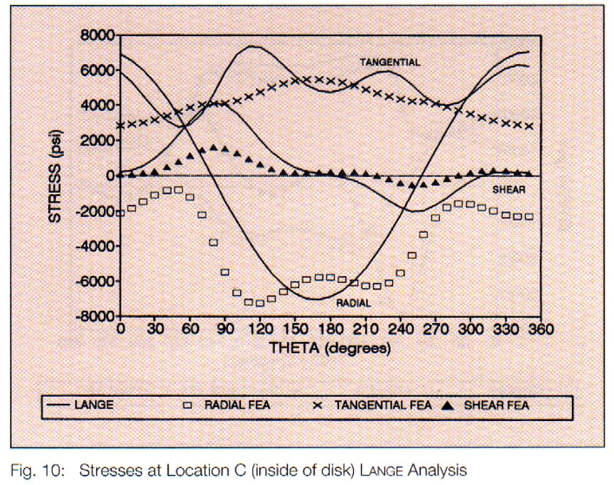

# A New Pulley Stress Analysis Method Based on Modified Transfer Matrix

**Authors:** Xiangjun Qiu and Vinit Sethi, USA  
**Publication:** Bulk Solids Handling, Vol. 13 No. 4, November 1993, pp. 713–724  
**Citations:** 10  
**Reads:** 151

---

## Abstract

A new pulley stress analysis method is presented, referred to as the **Modified Transfer Matrix Method (MTMM)**. This method is based on the formulation of transfer matrices for the pulley's cylindrical shell, end-disk plate with non-uniform thickness, and by using the element concepts. It combines the strength of both classical stress analysis methods and finite element methods. It proves to be an efficient and effective approach in determining the stresses in a pulley.

A pulley stress analysis program named **PSTRESS 3.0** has been developed based on this new method. At the end of the paper, a numerical example of belt conveyor pulley stress analysis, using PSTRESS 3.0, is given. The result is satisfactorily compared with that obtained from a finite element model (ANSYS) solution with a very fine mesh.

---

## Nomenclature

### Coordinate Systems and Displacements
| Symbol | Description |
|:--|:--|
| x, y, z | Cartesian coordinates in the normal, circumferential, and axial directions of pulley |
| r, θ, z | Cylindrical coordinates in radial, circumferential, and axial directions |
| u, v, w | Displacements in x, y, z or r, θ, z directions |
| s | Axial or radial coordinate |

### Material Properties
| Symbol | Description |
|:--|:--|
| E | Young's modulus of disk or cylindrical shell of pulley |
| μ | Poisson's ratio of disk or cylindrical shell of pulley |
| t | Thickness of disk or cylindrical shell of pulley |
| c | Coefficient to describe the geometry of disk variable thickness |
| p | Exponential number to describe the geometry of disk variable thickness |
| G | Shear modulus of shaft material |
| ρ | Density |

### Structural Parameters
| Symbol | Description |
|:--|:--|
| R | Cylindrical shell radius |
| r₀, rᵢ | Outer and inner radii of pulley shell |
| D | Cross-section bending stiffness of disk or cylindrical shell |
| m | Fourier component number |

### Beam Element Parameters
| Symbol | Description |
|:--|:--|
| P | Shear force acting on shaft cross section |
| M | Bending moment acting on shaft cross section |
| q | Distributed load acting on shaft axis |
| wₛ | Transverse displacement of shaft neutral axis |
| θₛ | Rotational angle of shaft cross section |
| EI | Shaft bending stiffness |
| a | Shaft cross section area |
| β | Shaft state variable vector |
| A | Matrix containing coefficients of governing ODEs for shaft bending deformation |
| B | Vector representing the non-homogeneous term of the governing ODEs for shaft bending deformation |
| T | Transfer matrix for governing ODEs for shaft bending deformation |
| Kᵦₘ | TMB beam element stiffness matrix |
| Uᵦₘᴰ | TMB beam element displacement vector |
| Fₑₓₜᴮᴹ | TMB beam element external force vector |
| Fᵢₙₜᴮᴹ | TMB beam element internal force vector |

### Disk Plate Element Parameters
| Symbol | Description |
|:--|:--|
| Qᵣ | Transverse shear force acting on the disk cross section perpendicular to radial direction |
| Qθ | Transverse shear force acting on the disk cross section perpendicular to circumferential direction |
| Nᵣθ | In-plane shear force acting on the disk cross sections perpendicular to disk radial direction and disk circumferential direction |
| Nᵣ | Normal force acting on the disk cross section perpendicular to radial direction |
| Nθ | Normal force acting on the disk cross section perpendicular to circumferential direction |
| Mᵣ | Bending moment acting on the disk cross section perpendicular to disk radial direction |
| Mθ | Bending moment acting on the disk cross section perpendicular to circumferential direction |
| Mᵣθ | Twisting moment acting on the disk cross sections perpendicular to disk radial direction and disk circumferential direction |
| g | External transverse force acting on the neutral surface of the disk |
| uₘ, vₘ, wₘ, gₘ | Fourier components of u, v, w, g |
| Qᵣₘ, Qθₘ | Fourier components of Qᵣ, Qθ |
| Mᵣₘ, Mθₘ, Mᵣθₘ | Fourier components of Mᵣ, Mθ, Mᵣθ |
| Nᵣₘ, Nθₘ, Nᵣθₘ | Fourier components of Nᵣ, Nθ, Nᵣθ |
| γₘ | Disk bending state variable vector of Fourier component m |
| ηₘ | Disk plane-stress state variable vector of Fourier component m |
| Aₘ | Matrix containing coefficients of governing ODEs for disk bending deformation of Fourier component m |
| Bₘ | Vector representing the non-homogeneous term of the governing ODEs for disk bending deformation of Fourier component m |
| Cₘ | Matrix containing coefficients of governing ODEs for disk in-plane deformation of Fourier component m |
| Uᵦᴰᵐ | TMB disk bending element displacement vector |
| Kᵦᴰₘ | TMB disk bending element stiffness matrix |
| Fₑₓₜᴮᴰ | TMB disk bending element external force vector |
| Fᵢₙₜᴮᴰ | TMB disk bending element internal force vector |
| Uₚₙᴰᵐ | TMB disk plane-stress element displacement vector |
| Kₚₙₘ | TMB disk plane-stress element stiffness matrix |
| Fₑₓₜᴾᴺ | TMB disk plane-stress element external force vector |
| Fᵢₙₜᴾᴺ | TMB disk plane-stress element internal force vector |
| Uᴰᴷₘ | TMB disk element displacement vector |
| Kᴰᴷₘ | TMB disk element stiffness matrix |
| Fₑₓₜᴰᴷ | TMB disk element external force vector |
| Fᵢₙₜᴰᴷ | TMB disk element internal force vector |

### Cylindrical Shell Element Parameters
| Symbol | Description |
|:--|:--|
| N₁ | Normal force acting on the cylindrical shell cross section perpendicular to pulley axial direction |
| N₂ | Normal force acting on the cylindrical shell cross section perpendicular to pulley circumferential direction |
| S | Membrane shear force acting on the cylindrical shell cross sections perpendicular to pulley axial direction and circumferential direction |
| Q₁ | Transverse shear force acting on the cylindrical shell cross section perpendicular to pulley axial direction |
| Q₂ | Transverse shear force acting on the cylindrical shell cross section perpendicular to pulley circumferential direction |
| M₁ | Bending moment acting on the cylindrical shell cross section perpendicular to pulley axial direction |
| M₂ | Bending moment acting on the cylindrical shell cross section perpendicular to pulley circumferential direction |
| M₁₂ | Twisting moment acting on the cylindrical shell cross sections perpendicular to pulley axial direction and circumferential direction |
| fₓ | External load acting on the neutral surface of shell in pulley axial direction |
| fθ | External load acting on the neutral surface of shell in pulley circumferential direction |
| fᵣ | External load acting on the neutral surface of shell in pulley radial direction |
| fₓₘ, fθₘ, fᵣₘ | Fourier components of fₓ, fθ, fᵣ |
| N₁ₘ, N₂ₘ | Fourier components of N₁, N₂ |
| Sₘ | Fourier component of S |
| M₁ₘ, M₂ₘ, M₁₂ₘ | Fourier components of M₁, M₂, M₁₂ |
| Vₘ | Fourier component of element boundary equivalent transverse shear force |
| ξₘ | Cylindrical shell state variable vector of Fourier component m |
| Jₘ | Matrix containing coefficients of governing ODEs of a pulley component |
| Lₘ | Vector representing the non-homogeneous term of the governing ODEs of a pulley component |
| Hₘ | Matrix containing coefficients of governing ODEs of a pulley component |
| Uₘ | Generalized displacements of state variable of a pulley component |
| Fₘ | Generalized forces of state variable vector of a pulley component |
| Tₘ | Transfer matrix for the governing ODEs of a pulley component |
| Uᶜˢₘ | TMB cylindrical shell element displacement vector |
| Kᶜˢₘ | TMB cylindrical shell element stiffness matrix |
| Fₑₓₜᶜˢ | TMB cylindrical shell element external force vector |
| Fᵢₙₜᶜˢ | TMB cylindrical shell element internal force vector |
| Ψₘ | State variable vector of Fourier component m |

### General TMB Parameters
| Symbol | Description |
|:--|:--|
| Dₘ | TMB element displacement vector of a pulley component |
| Kₘ | TMB element stiffness matrix of a pulley component |
| Fᵢₙₜₘ | TMB element internal force vector of a pulley component |
| Fₑₓₜₘ | TMB element external force vector of a pulley component |
| Nₕ | Harmonic order in Fourier expansion |
| Kₜₘᵦ | Overall transfer matrix of pulley assembly |

---

## 1. Introduction

An engineered belt conveyor pulley typically consists of a cylindrical shell, two end disks with variable thickness, a shaft, and two locking devices which connect the shaft to the end disks. Figure 1 shows a typical cross-section of such a pulley assembly.

### 1.1 Background

The pulley is usually subjected to severe bending due to very high belt tensions and locking pressures. In the design of such a pulley, it is necessary to take into account the possibility of fatigue failure. Costly failures in large conveyor pulleys have led designers to seek detailed stress tabulation or endurance analysis.

### 1.2 Existing Methods

To date, two types of approaches for pulley stress analysis have been reported in the literature:

1. **Classical Mechanics Approach** - Developed by Lange [1] and Schmoltz [2]. This is an approximate analytical approach, providing a closed-form solution for stresses in a pulley. The advantages of this method are:
   - Easy to program
   - Very short execution time to obtain a solution
   
   However, the disadvantages are:
   - Stress solution is not accurate at locations near the connection region between the end disks and rim
   - Poor approximation in treating the elastic coupling between components
   - End disk and shell are not coupled at their connection
   - Cannot handle complex boundary conditions

2. **Finite Element Method (FEM)** - Employed by Vonsthal [3], Danel [4], and Sethi et al. [5]. Both types of approaches have advantages and disadvantages.

### 1.3 Advantages of FEM
- Versatile in treating geometry and boundary conditions
- Accurate when properly used

### 1.4 Disadvantages of FEM
- Long execution time
- Requires experienced user to generate proper finite element mesh
- Data-intensive preparation

### 1.5 The New Method: Modified Transfer Matrix Method (MTMM)

In this paper, a new method called the **Modified Transfer Matrix Method (MTMM)** is presented. This method inherits the advantages of both the Lange classical method and the conventional FEM. The MTM method proves to be a very effective and efficient approach in providing an accurate pulley assembly stress solution for any loading condition and pulley geometry.

Historically, the transfer matrix method was developed several decades ago [6] and was very popular in solving one-dimensional structural and dynamic problems before the advent of the FEM. Even today, this method is still useful in providing closed-form solutions for some one-dimensional structural problems with simple boundary conditions [7].

Although the transfer matrix method is not suitable for complicated boundary conditions, the solution obtained by using the transfer matrix method is exact when the limitation of the transfer matrix method can be overcome. In this paper, it is shown that the limitation of the transfer matrix is reformulated by introducing finite element concepts.

### 1.6 TMB Finite Elements

The reformulated transfer matrix is essentially a special finite element called **transfer matrix based (TMB) finite elements**, which is capable of solving a class of structural analysis problems (including the elasticity problem of a pulley), whose governing differential equations can be reduced to a set of ordinary differential equations (ODEs).

Regardless of how few of these TMB finite elements are used in a model, the solution obtained by this MTM method is generally very accurate due to the nature of the transfer matrix method.

---

## 2. TMB Finite Elements for Beam, Disk Plate and Cylindrical Shell

Stresses and displacements in a pulley can be expressed in terms of Fourier series with respect to the circumferential angle because of the pulley's axisymmetric geometry. Each Fourier component of the solution can be obtained by solving a set of corresponding governing differential equations, which are uncoupled from governing equations for other Fourier components.

In Appendices A, B and C, it is shown that the governing equations for Fourier components for shaft, end-disk plate of non-uniform thickness, and cylindrical shell of a pulley can be reduced to a set of ODEs of the first order respectively.

### 2.1 General Form

The general solutions to these ODEs can be expressed in terms of the transfer matrix. By following the procedure described in Appendix D, the general solutions can be reorganized in a finite element form as below:

$$K_m D_m = F_{int m} + F_{ext m} \quad (1)$$

where:
- $K_m$ is the TMB element stiffness matrix
- $D_m$ is the element displacement vector
- $F_{int m}$ is the element internal force vector
- $F_{ext m}$ is the element external force vector
- The subscript $m$ denotes the Fourier component number

The detailed procedures for developing TMB element for shaft, end-disk and cylindrical shell are given in Appendices A, B and C, respectively.

### 2.2 Key Features of TMB Elements

**Remarks:**

As seen in the above discussion, the general solution to the governing differential equations for a pulley can be finally transformed to a finite-element form. This enables us to convert many finite element analysis (FEA) capabilities to resolve pulley stresses using MTM method.

The most valuable FEA capability to be employed is the way of treating complicated boundary conditions. Therefore, using the MTM method, we can easily take into account the elastic coupling between the rim and the end-disk by following FEA assembly procedures, and implement the locking assembly pressure by using the FEA approach of treating contact interfacial forces acting internally between two bodies.

Both of these problems cannot be easily or precisely handled by most classical methods.

---

## 3. Assembly of TMB Elements for a Pulley Model in PSTRESS 3.0

In PSTRESS 3.0, the above derived TMB beam, disk plate and cylindrical shell element stiffness matrices are brought together to form a global stiffness matrix for a pulley in essentially the same way as in conventional FEM. However, care must be taken at two locations, where special element assembly methods are required.

### 3.1 First Location: Shell and End Disk Connection

The first location is the connection region between the shell and the disk shown in Figure 2a, where the finite dimension of the joint has to be taken into account when forming the stiffness matrix. The conventional way of treating the elastic stiffness is to treat this as a point connection, which causes significant error in the stress solutions near this region.

One approach, not completely correct, is providing correct elastic stiffness to connect the rim and the disk treating the whole region as a special "superstructure". In PSTRESS 3.0, such a special element shown in Figure 2b is developed for this purpose.

### 3.2 Second Location: Locking Device and Shaft Connection

The second location is the connection point between the locking device and the shaft. One thing that must be kept in mind when assembling elements in this location is that the final solution consists of many Fourier components, of which only m = 0, 1 element only contributes to the Fourier components of m = 0 and 1 (i.e., the shaft deformation can be exactly modeled by a TMB cylindrical shell element presented in Appendix C).

When a TMB beam element described in Appendix A is used, representing the shaft deformation of components of m = 0 and 1 (i.e., bending deformation), the following constraints on the deformation of the connecting point must be imposed:

$$w_m = -m \, v_m \quad (2)$$

$$u_m = r_{shaft} \, θ_m \quad (3)$$

$$w'_s = w_m \quad (4)$$

$$θ_s = θ_m \quad (5)$$

where:
- $w_s$ and $θ_s$ are the shaft deflection and rotational angle respectively at the connecting point, where the subscript s denotes shaft deformation
- The general definitions of $w_s$ and $θ_s$ are given in Appendix A

$u_m$, $v_m$, $w_m$ and $θ_m$ are disk plate displacements and rotational angle at the connecting point, where the subscript m denotes the Fourier component number: $m = -1$ or $1$. The general definitions of $u_m$, $v_m$, $w_m$ and $θ_m$ are given in Appendix B. $r_{shaft}$ is the shaft radius at the connection point.

Such constraints are easy to implement in a finite element model by using FEA static condensation or penalty methods [10]. In PSTRESS 3.0, the static condensation method is employed.

Finally, it must be pointed out that the TMB beam element stiffness matrix and corresponding nodal forces must be multiplied by a factor of 2 before they are assembled into global equations, due to the difference between actual forces and harmonic forces.

---

## 4. Numerical Example

Consider the belt conveyor pulley shown in Figure 1, which is supported by two bearings and subjected to a locking pressure of 115.71 MPa (16,778 psi) at the interface between the locking device and disk hub. The shell circumferential surface pressure and shear loading between circumferential angles of 83° and 254° are developed from unequal belt tensions $T_1 = 1,017.8 kN$ (228,800 lb) and $T_2 = 632.98 kN$ (142,300 lb) shown in Figure 3.

### 4.1 Material Properties and Geometry

The material properties and geometrical parameters of the pulley are given in Table 1. This pulley is analyzed by using PSTRESS 3.0 and CDI's derivation of the classical method, respectively.

**Table 1: Material properties and geometrical parameters**

#### Material Property
| Property | Value |
|:--|:--|
| Young's modulus, MPsi | 30 |
| Poisson's ratio | 0.3 |

#### Rim Geometry
| Parameter | Value |
|:--|:--|
| Rim length, inches | 82 |
| Rim outer diameter, inches | 54 |
| Rim thickness, inches | 1.5 |
| Belt width, inches | 72 |

#### Disk Geometry
| Parameter | Dimension (inches) | Thickness |
|:--|:--|:--|
| Locking device width, inches | 3.3 | |
| Hub inner diameter, inches | 27.6 | |
| Hub inner diameter, inches | 20.27 | |
| Hub width, inches | 6.7 | |
| Fillet radius at hub, inches | 3.67 | |
| Fillet radius at rim, inches | 1.20 | |
| Disk thickness between hub and rim, inches | | |
| 1. | 15.610 | 1.740 |
| 2. | 16.268 | 1.467 |
| 3. | 19.321 | 1.409 |
| 4. | 22.400 | 1.217 |
| 5. | 22.742 | 1.199 |

#### Shaft Geometry
| Parameter | Value |
|:--|:--|
| Diameter, inches | 10.535 |
| Shaft length, inches | 121 |
| Distance between bearing centres, inches | 104 |
| Distance between side-centres, inches | 74.13 |

### 4.2 Analysis Approach

Because of symmetry, only one quarter of the 2-D cross-section is modeled. In the PSTRESS model, the rim is modeled with 2 TMB elements, the disk is modeled with 8 TMB elements, the shaft is modeled with 3 TMB elements, and 71 Fourier components are used for solution.

The reason we use more TMB elements for the disk is the necessity of taking account of the non-uniform thickness of the rim. In the ANSYS FEA model, 5,000 axisymmetric structural solid elements (with non axis-symmetric loading) are employed in the 2-D cross-section.

The use of the ANSYS FEM package to analyze a pulley is discussed in [5].

### 4.3 Results Comparison

Figures 4–7 show the PSTRESS numerical results compared with the ANSYS results. From these figures, it is seen that at location A of the rim and location D of the disk the agreement between the results of the MTM method and the results of the conventional FEM is good.

At location B of the rim and location C of the disk, the agreement is still good, but some inaccuracy is observed. The reason may be that locations B and C are within the connection region between the rim and disk, where the 3-D stress state is more significant and cannot be fully taken into account by 2-D shell and plate theories.

According to St. Venant's principle and our experience, this 3-D stress state has only a very local effect on pulley stress solution when the thicknesses of rim and disk are relatively small compared with the length and radius of the rim. It must be noted that the MTM method is much more efficient than the conventional FEM.

### 4.4 Computational Efficiency

- **PSTRESS 3.0** takes approximately 30 seconds to obtain the solution on an IBM PC 486, including the fatigue analysis
- **FEM (ANSYS)** solution takes 12-24 hours on an IBM RISC 6000 workstation

### 4.5 Additional Validation

Figures 8–11 show the comparison of numerical results between Lange's solution and the FEM solution. Except at location A, Lange's solution does not agree with the FEM solution. The poor agreement is due to the errors in treating the elastic coupling between the rim and the end-disk in Lange's method.

Figures 12 and 13 show both the PSTRESS and ANSYS results at two corners of the interface between the locking device and the shaft (locations D and E of Figure 1). At these two locations, 3-D stress state is much more significant than at locations B and C.

In order to produce more accurate stress solutions at the two corners, we introduce stress concentration factors in zero and first order Fourier component solutions by using our empirical formulae built in PSTRESS 3.0. As seen in Figures 12 and 13, these corrected solutions agree well with ANSYS solutions.

---

## 5. Conclusions

A new pulley stress analysis method which is based on reformulated transfer matrix has been developed. An accurate solution can be obtained by using this method. Three transfer matrix-based elements for the shaft, disk plate and cylindrical shell have been developed. A numerical example has been given, which demonstrates the merits of this new method.

### Key Conclusions:

1. **Combines Advantages**: The MTMM combines the analytical advantages of the classical transfer-matrix method with finite-element discretization capabilities

2. **Handles Complex Geometry**: The method can handle pulleys with:
   - Variable shell thickness
   - Stiffener rings
   - Non-uniform disk thickness
   - Complex boundary conditions
   - Locking assembly pressure

3. **Accuracy**: Results closely match ANSYS FEM solutions (within 2-5% at most locations)

4. **Efficiency**: Provides comparable accuracy to FEM but with:
   - Simpler data preparation
   - Smaller system matrices
   - Much faster computation (30 seconds vs 12-24 hours)
   - Suitable for computer implementation in PSTRESS 3.0

5. **Practical Application**: The method has been successfully implemented in PSTRESS 3.0, developed in FORTRAN 77 on IBM RS/6000

6. **Stress Concentration**: The method can incorporate stress concentration factors for critical locations, improving accuracy in high-stress regions

---

## References

[1] Lange, H.H.: *Investigations on Stress in Belt Conveyor Pulleys*, Doctoral Thesis, Technical University Hannover, 1963.

[2] Schmoltz, W.: *The Design of Conveyor Belt Pulleys with Cylindrical Shells*, Doctoral Thesis, Technical University Hannover, 1974.

[3] Vonsthal, R.: "Analysis of Belt Conveyor Pulleys Using Finite Element Method," Proc. 4th Int. Conf. in Australia on Finite Element Methods, University of Melbourne, Aug. 18-20, 1982.

[4] Danel, W.J.T.: Development of a Conveyor Pulley Stress Analysis Package; Proc. Int. Conf. on Bulk Material Storage, Handling and Transportation, Newcastle, Aug. 22-24, 1983.

[5] Sethi, V. and Nordell, L. K.: Modern Pulley Design Techniques and Failure Analysis Methods; Proceedings of SME Annual Meeting & Exhibit, Reno Nevada, USA, Feb. 15-18, 1993.

[6] Pestel, E.C. and Lecke, F.A.: Matrix Methods in Elastomechanics; New York McGraw-Hill Book Co., 1963.

[7] Yeh Kaiyuan: General Solution on Certain Problems of Elasticity with Non-Homogeneity and Variable Thickness, The Advances of Applied Mathematics and Mechanics, Vol. 9; China Academic Publishers, pp 240-273, 1987.

[8] Boyce, W.E. and DiPrima, R.C.: Elementary Differential Equations; Fifth Edition, John Wiley & Sons Inc., New York, 1992.

[9] Timoshenko, S. and Woinowsky-Krieger, S.: Theory of Plates and Shells; McGraw-Hill Book Co., Second Edition, 1959.

[10] Cook, R.D., Malkus, D.S. and Plesha, M.E.: Concepts and Applications of Finite Element Analysis; Third Edition, John Wiley & Sons Inc., 1989.

---

## Appendix A: TMB Finite Element for Beam

### A.1 Governing Equations

Figure A1 shows forces that act on a differential beam element. Loads P, M, and q are shown in their positive sense, z is the axial coordinate. The equilibrium equations are:

$$\frac{dP}{dz} = -q \quad (A1)$$

$$\frac{dM}{dz} = P \quad (A2)$$

By using Timoshenko's beam theory, we have:

$$\frac{dw_s}{dz} = -θ_s + \frac{P}{kaG} \quad (A3)$$

$$\frac{dθ_s}{dz} = \frac{M}{EI} \quad (A4)$$

where the subscript s denotes the shaft deformation, $w_s$ is the shaft neutral axis displacement, $θ_s$ is the slope due to bending, $dw_s/dz$ is the slope of the center line of the beam, $k$ is a shape factor equal to 0.75 for circular cross section, $EI$ is the bending stiffness, $a$ is the cross-section area, and $G$ is the shear modulus.

Equations (A1)-(A4) can be written in a matrix form:

$$\frac{d\beta}{dz} = A\beta + B \quad (A5)$$

where:

$$\beta = (w_s, θ_s, P, M)^T \quad (A6)$$

$$B = (0, 0, -q, 0)^T \quad (A7)$$

and 

$$A = \begin{bmatrix}
0 & -1 & \frac{1}{kaG} & 0 \\
0 & 0 & 0 & \frac{1}{EI} \\
0 & 0 & 0 & 0 \\
0 & 0 & 1 & 0
\end{bmatrix} \quad (A8)$$

where $\beta$ is called state variable vector.

### A.2 General Solution

According to the ODE theory [8], the general solution to Eq. (A5) can be expressed as:

$$\beta(z) = T(z)\beta(z_0) + T(z) \int_{z_0}^z T(s)^{-1} B(s)ds \quad (A9)$$

where $z_0 \leq z \leq z_L$, $z_0$ and $z_L$ are the coordinates corresponding to two ends of the beam, and $T(z)$ is the transfer matrix satisfying:

$$\frac{dT}{dz} = AT \quad \text{and} \quad T(z_0) = I \quad (A10)$$

where $I$ is the identity matrix. Following the general procedure described in [8], we can obtain the following closed-form transfer matrix:

$$T(z) = \begin{bmatrix}
1 & z-z_0 & \frac{(z-z_0)^2}{kaG} & \frac{(z-z_0)^3}{6EI} & \frac{-(z-z_0)^2}{2EI} \\
0 & 1 & \frac{(z-z_0)}{kaG} & \frac{(z-z_0)^2}{2EI} & \frac{z-z_0}{EI} \\
0 & 0 & 1 & L & 0 \\
0 & 0 & z-z_0 & 1 & 0
\end{bmatrix} \quad (A11)$$

where $z_0 \leq z \leq z_L$. Following the procedure described in Appendix D, we can obtain the following finite element equation, which is equivalent to Eq. (A9):

$$K_{BM} U_{BM} = F_{int}^{BM} + F_{ext}^{BM} \quad (A12)$$

where:

$$U_{BM} = (w_s(z_L), θ_s(z_L), w_s(z_0), θ_s(z_0))^T \quad (A13)$$

$F_{ext}^{BM}$ is the beam element external force vector, $F_{int}^{BM}$ is the beam element internal force vector, and $K_{BM}$ is the beam element stiffness matrix, which can be expressed:

$$K_{BM} = \begin{bmatrix}
\frac{12EI}{L^3(1+\alpha)} & \text{Symmetric} & & \\
\frac{6EI}{L^2(1+\alpha)} & \frac{(4+\alpha)EI}{L(1+\alpha)} & & \\
\frac{-12EI}{L^3(1+\alpha)} & \frac{-6EI}{L^2(1+\alpha)} & \frac{12EI}{L^3(1+\alpha)} & \\
\frac{6EI}{L^2(1+\alpha)} & \frac{(2-\alpha)EI}{L(1+\alpha)} & \frac{-6EI}{L^2(1+\alpha)} & \frac{(4+\alpha)EI}{L(1+\alpha)} \\
\end{bmatrix} \quad (A14)$$

where:

$$\alpha = \frac{12EI}{L^2kaG} \quad \text{and} \quad L = z_L - z_0 \quad (A15)$$

**Remarks:**

It is not surprising to note that the TMB finite element stiffness matrix for a beam derived as Eq. (A14) is identical to the beam stiffness matrix derived by using conventional finite element method because the polynomial-type trial function used in conventional FEM exactly represents the actual beam displacement. However, for other types of structures such as plate and shell, the TMB element stiffness matrices may not be the same as the conventional finite element stiffness matrices.

---

## Appendix B: TMB Finite Element for Disk Plate with Variable Thickness

### B.1 TMB Bending Element

Figure B1 shows a differential element of plate subjected to bending loads. x, y and z are Cartesian coordinates with z coinciding with pulley axial direction, x horizontal direction, and y vertical direction. r and φ are disk cylindrical coordinates. Loads $Q_r$, $Q_φ$, $M_r$, $M_φ$, and $M_{rφ}$ are shown in their positive sense. The equilibrium equations are:

$$Q_r = \frac{∂M_r}{∂r} + \frac{M_r - M_φ}{r} - \frac{1}{r}\frac{∂M_{rφ}}{∂φ} \quad (B1)$$

$$Q_φ = \frac{∂M_{rφ}}{∂r} + \frac{2M_{rφ}}{r} - \frac{1}{r}\frac{∂M_φ}{∂φ} \quad (B2)$$

$$\frac{∂Q_r}{∂r} = \frac{Q_r}{r} - \frac{1}{r}\frac{∂Q_φ}{∂φ} = g(r,φ) \quad (B3)$$

where $g$ is the external transverse force acting on the neutral surface of the plate, and equations representing the force-deformation relationship are:

$$M_r = -D\left[\frac{∂^2u}{∂r^2} + μ\left(\frac{1}{r}\frac{∂u}{∂r} + \frac{1}{r^2}\frac{∂^2u}{∂φ^2}\right)\right] \quad (B4)$$

$$M_φ = -D\left[μ\frac{∂^2u}{∂r^2} + \frac{1}{r}\frac{∂u}{∂r} + \frac{1}{r^2}\frac{∂^2u}{∂φ^2}\right] \quad (B5)$$

$$M_{rφ} = D(1-μ)\left[\frac{1}{r}\frac{∂^2u}{∂r∂φ} - \frac{1}{r^2}\frac{∂u}{∂φ}\right] \quad (B6)$$

where $u$ is the plate neutral surface transverse displacement (see Fig. B1), μ is the Poisson's ratio,

$$D = \frac{Et^3}{12(1-μ^2)} \quad (B7)$$

$E$ is the Young's modulus, $t$ is the thickness of the plate, which is a function of $r$. Within the element, we assume:

$$t = cr^p \quad (B8)$$

where $c$ and $p$ are constants. Also, we assume the following Fourier series for the components of displacement and forces:

$$u = \sum_{m=0}^{\infty} u_m \cos mφ + \sum_{m=1}^{\infty} u_{-m} \sin mφ \quad (B9)$$

$$g = \sum_{m=0}^{\infty} g_m \cos mφ + \sum_{m=1}^{\infty} g_{-m} \sin mφ \quad (B10)$$

$$Q_r = \sum_{m=0}^{\infty} Q_{rm} \cos mφ + \sum_{m=1}^{\infty} Q_{r,-m} \sin mφ \quad (B11)$$

$$Q_φ = \sum_{m=1}^{\infty} Q_{φm} \sin mφ + \sum_{m=0}^{\infty} Q_{φ,-m} \cos mφ \quad (B12)$$

$$M_r = \sum_{m=0}^{\infty} M_{rm} \cos mφ + \sum_{m=1}^{\infty} M_{r,-m} \sin mφ \quad (B13)$$

$$M_φ = \sum_{m=0}^{\infty} M_{φm} \cos mφ + \sum_{m=1}^{\infty} M_{φ,-m} \sin mφ \quad (B14)$$

$$M_{rφ} = \sum_{m=1}^{\infty} M_{rφm} \sin mφ + \sum_{m=0}^{\infty} M_{rφ,-m} \cos mφ \quad (B15)$$

where $u_m$, $g_m$, $Q_{rm}$, $Q_{φm}$, $M_{rm}$, $M_{φm}$, $M_{rφm}$ ($m = 0, ±1, ±2, ...$) are functions of $r$ only. Substituting Eqs. (B9)-(B15) into Eqs. (B1)-(B6), we have the following ordinary differential equations:

$$Q_{rm} = M'_{rm} + \frac{1}{r}(M_{rm} - M_{φm}) - \frac{m}{r}M_{rφm} \quad (B16)$$

$$Q_{φm} = M'_{rφm} + \frac{2}{r}M_{rφm} + \frac{m}{r}M_{φm} \quad (B17)$$

$$Q'_{rm} + \frac{1}{r}Q_{rm} - \frac{m}{r}Q_{φm} = g_m \quad (B18)$$

$$M_{rm} = -D\left[u''_m + μ\left(\frac{1}{r}u'_m - \frac{m^2}{r^2}u_m\right)\right] \quad (B19)$$

$$M_{φm} = -D\left[μu''_m + \frac{1}{r}u'_m - \frac{m^2}{r^2}u_m\right] \quad (B20)$$

$$M_{rφm} = D(1-μ)\left[-\frac{m}{r}u'_m + \frac{m}{r^2}u_m\right] \quad (B21)$$

where $m = 0, ±1, ±2, ...$, and the prime represents derivative with respect to $r$. Introducing the following state variables:

$$γ_m = (u_m, θ_m, v_m, m_m)^T \quad (B22)$$

where:

$$θ_m = u'_m \quad (B23)$$

$$m_m = -2πrM_{rm} \quad (B24)$$

$$v_m = 2πr\left(Q_{rm} - \frac{m}{r}M_{rφm}\right) \quad (B25)$$

Eliminating five variables, $M_{rm}$, $M_{φm}$, $M_{rφm}$, $Q_{rm}$ and $Q_{φm}$ among Eqs. (B16)-(B21) and (B23)-(B25), we can obtain the following matrix-form equation:

$$\frac{dγ_m}{dr} = A_m γ_m + B_m \quad (m = 0, ±1, ±2, ...) \quad (B26)$$

where $A_m$ and $B_m$ are matrices containing coefficients derived from the governing ODEs.

$$B_m = (0, 0, 2πrg_m, 0)^T \quad (B28)$$

Therefore, following the procedure described in Appendix D, we can obtain the following finite element equation for a circular plate ring ($r_i \leq r \leq r_L$) with variable thickness and subjected to harmonic bending load:

$$K_{BD,m} U_m^{BD} = F_{int,m}^{BD} + F_{ext,m}^{BD} \quad (B29)$$

where:

$$U_m^{BD} = (u_{Lm}, θ_{Lm}, u_{0m}, θ_{0m})^T \quad (B30)$$

$K_{BD,m}$ is the plate element bending stiffness matrix, $F_{ext,m}^{BD}$ is the element external force vector, $F_{int,m}^{BD}$ is the element internal force vector, the subscript $L$ and $0$ denote locations at $r = r_L$ and $r_0$, respectively, and $m$ denotes the Fourier component number.

Due to the complexity in deriving the transfer matrix for Eq. (B26), it is much more difficult to obtain a closed-form expression for $K_{BD,m}$ of Eq. (B29) than for $K_{BM}$ of Eq. (A12). Instead, we can very accurately calculate $K_{BD,m}$ by using our computer program of PSTRESS 3.0 mentioned in Remark ii of Appendix D.

### B.2 TMB Plane Stress Element

Figure B2 shows a differential element of plate subjected to in-plane loading. Loads $N_r$, $N_φ$, and $N_{rφ}$ are shown in their positive sense. The equilibrium equations for the disk in the plane of $x$, $y$, $z$, $r$ and $φ$ are the same as in section B.1. The equilibrium equations are:

$$\frac{∂N_r}{∂r} + \frac{N_r - N_φ}{r} + \frac{1}{r}\frac{∂N_{rφ}}{∂φ} = 0 \quad (B31)$$

$$\frac{∂N_{rφ}}{∂r} + \frac{2N_{rφ}}{r} + \frac{1}{r}\frac{∂N_φ}{∂φ} = 0 \quad (B32)$$

The equations for force-deformation relationship are:

$$N_r = \frac{Et}{(1-μ^2)}\left(\frac{∂w}{∂r} + μ\frac{w}{r} + μ\frac{1}{r}\frac{∂v}{∂φ}\right) \quad (B33)$$

$$N_φ = \frac{Et}{(1-μ^2)}\left(μ\frac{∂w}{∂r} + \frac{w}{r} + \frac{1}{r}\frac{∂v}{∂φ}\right) \quad (B34)$$

$$N_{rφ} = \frac{Et}{2(1+μ)}\left(\frac{∂v}{∂r} + \frac{1}{r}\frac{∂w}{∂φ} - \frac{v}{r}\right) \quad (B35)$$

where $m = 0, ±1, ±2, ±3, ...$. Introducing the following state variables:

$$η_m = (w_m, v_m, 2πrN_{rm}, 2πrN_{rφm})^T \quad (B46)$$

and eliminating $N_{φm}$ among Eqs. (B 41)-(B45), we obtain:

$$\frac{dη_m}{dr} = C_m η_m \quad (m = 0, ±1, ±2, ...) \quad (B47)$$

where $C_m$ is a matrix containing coefficients of governing ODEs for disk in-plane deformation.

Thus, following the similar procedure in deriving Eq. (B29), we can finally derive the following TMB finite element equation for a circular ring ($r_i \leq r \leq r_L$) with variable thickness, subjected to in-plane harmonic loading:

$$K_{PN,m} U_m^{PN} = F_{int,m}^{PN} + F_{ext,m}^{PN} \quad (B49)$$

where:

$$U_m^{PN} = (w_{Lm}, v_{Lm}, w_{0m}, v_{0m})^T \quad (B50)$$

$K_{PN,m}$ is the element plane-stress stiffness matrix, $F_{ext,m}^{PN}$ is the element external force vector, $F_{int,m}^{PN}$ is the element internal force vector, and the subscript $L$ and $0$ denote locations at $r = r_i$ and $r_0$, respectively, and $m$ denotes the Fourier component number.

Combining Eq. (B29) and Eq. (B49), we can form a TMB shell element for disk plate, which is subjected to both bending and in-plane loading:

$$K_{DK,m} U_m^{DK} = F_{int,m}^{DK} + F_{ext,m}^{DK} \quad (B51)$$

where $K_{DK,m}$ is the disk element stiffness matrix, $U_m^{DK}$ is the element displacement vector, $F_{ext,m}^{DK}$ is the element external force vector and $F_{int,m}^{DK}$ is the element internal force vector. They can be calculated by the following formulae:

$$U_m^{DK} = (u_{Lm}, v_{Lm}, w_{Lm}, θ_{Lm}, u_{0m}, v_{0m}, w_{0m}, θ_{0m})^T \quad (B52)$$

$$K_{DK,m} = S_1^T K_{BD,m} S_1 + S_2^T K_{PN,m} S_2 \quad (B53)$$

$$F_{int,m}^{DK} = S_1^T F_{int,m}^{BD} + S_2^T F_{int,m}^{PN} \quad (B54)$$

$$F_{ext,m}^{DK} = S_1^T F_{int,m}^{BD} + S_2^T F_{ext,m}^{PN} \quad (B55)$$

$$S_1 = \begin{bmatrix}
1 & 0 & 0 & 0 & 0 & 0 & 0 & 0 \\
0 & 0 & 0 & 1 & 0 & 0 & 0 & 0 \\
0 & 0 & 0 & 0 & 1 & 0 & 0 & 0 \\
0 & 0 & 0 & 0 & 0 & 0 & 0 & 1
\end{bmatrix} \quad (B56)$$

**Remarks:**

iv. Any other state variables than those defined in Eq. (B22) and Eq. (B46) cannot be employed because they may lead to incorrect element stiffness matrices and force vectors due to the violation of Maxwell's reciprocal theorem.

v. Stiffness matrices obtained from transfer matrices must be symmetric. Any mistakes in choosing state variables, in deriving equations, and/or in numerical programming may lead to asymmetric stiffness matrices.

---

## Appendix C: TMB Finite Element for Cylindrical Shell

### C.1 Governing Equations

Figure C1 shows forces acting on a differential element of a cylindrical shell with constant thickness $t$ and radius $R$. z and φ are cylindrical coordinates. Loads $N_1$, $N_2$, $S$, $Q_1$, $Q_2$, $M_1$, $M_2$ and $M_{12}$ are shown in their positive sense. The equilibrium equations, according to [9], are:

$$\frac{∂N_1}{∂z} + \frac{∂S}{∂φ} + f_z = 0 \quad (C1)$$

$$\frac{∂N_2}{R∂φ} + \frac{∂S}{∂z} + f_φ = 0 \quad (C2)$$

$$\frac{N_2}{R} + \frac{∂Q_1}{∂z} + \frac{∂Q_2}{R∂φ} + f_r = 0 \quad (C3)$$

$$Q_2 = \frac{∂M_{12}}{∂z} + \frac{∂M_2}{R∂φ} \quad (C4)$$

$$Q_1 = \frac{∂M_1}{∂z} + \frac{∂M_{12}}{R∂φ} \quad (C5)$$

where $f_z$, $f_φ$ and $f_r$ are external loads acting on the neutral surface of the shell in axial, circumferential and radial directions respectively, and the equations for force-displacement relationship, according to [9], are:

$$N_1 = \frac{Et}{(1-μ^2)}\left(\frac{∂u}{∂z} + μ\frac{∂v}{R∂φ} + μ\frac{w}{R}\right) \quad (C6)$$

$$N_2 = \frac{Et}{(1-μ^2)}\left(\frac{∂u}{∂z} + \frac{∂v}{R∂φ} + \frac{w}{R}\right) \quad (C7)$$

$$S = \frac{Et}{2(1+μ)}\left(\frac{∂u}{R∂φ} + \frac{∂v}{∂z}\right) \quad (C8)$$

$$M_1 = -D\left(\frac{∂^2w}{∂z^2} + μ\frac{∂^2w}{R^2∂φ^2}\right) \quad (C9)$$

$$M_2 = -D\left(μ\frac{∂^2w}{∂z^2} + \frac{∂^2w}{R^2∂φ^2}\right) \quad (C10)$$

$$M_{12} = -(1-μ)D\frac{∂^2w}{R∂z∂φ} \quad (C11)$$

where $u$, $v$ and $w$ are shell neutral surface displacements in axial, circumferential and radial directions, respectively,

$$D = \frac{Et^3}{12(1-μ)}$$

the definitions of $E$ and μ are the same as in section B, and $t$ is the constant shell thickness. We assume the following Fourier components of displacements and forces:

$$f_z = \sum_{m=0}^{\infty} f_{zm} \cos mφ + \sum_{m=1}^{\infty} f_{z,-m} \sin mφ \quad (C12)$$

$$f_φ = \sum_{m=1}^{\infty} f_{φm} \sin mφ + \sum_{m=0}^{\infty} f_{φ,-m} \cos mφ \quad (C13)$$

$$f_r = \sum_{m=0}^{\infty} f_{rm} \cos mφ + \sum_{m=1}^{\infty} f_{r,-m} \sin mφ \quad (C14)$$

$$u = \sum_{m=0}^{\infty} u_m \cos mφ + \sum_{m=1}^{\infty} u_{-m} \sin mφ \quad (C15)$$

$$v = \sum_{m=1}^{\infty} v_m \sin mφ + \sum_{m=0}^{\infty} v_{-m} \cos mφ \quad (C16)$$

$$w = \sum_{m=0}^{\infty} w_m \cos mφ + \sum_{m=1}^{\infty} w_{-m} \sin mφ \quad (C17)$$

$$N_1 = \sum_{m=0}^{\infty} N_{1m} \cos mφ + \sum_{m=1}^{\infty} N_{1,-m} \sin mφ \quad (C18)$$

$$N_2 = \sum_{m=0}^{\infty} N_{2,m} \cos mφ + \sum_{m=1}^{\infty} N_{2,-m} \sin mφ \quad (C19)$$

$$S = \sum_{m=1}^{\infty} S_m \sin mφ + \sum_{m=0}^{\infty} S_{-m} \cos mφ \quad (C20)$$

$$M_1 = \sum_{m=0}^{\infty} M_{1,m} \cos mφ + \sum_{m=1}^{\infty} M_{1,-m} \sin mφ \quad (C21)$$

$$M_2 = \sum_{m=0}^{\infty} M_{2m} \cos mφ + \sum_{m=1}^{\infty} M_{2,-m} \sin mφ \quad (C22)$$

$$M_{12} = \sum_{m=1}^{\infty} M_{12m} \sin mφ + \sum_{m=0}^{\infty} M_{12,-m} \cos mφ \quad (C23)$$

$$Q_1 = \sum_{m=0}^{\infty} Q_{1m} \cos mφ + \sum_{m=1}^{\infty} Q_{1,-m} \sin mφ \quad (C24)$$

$$Q_2 = \sum_{m=1}^{\infty} Q_{2m} \sin mφ + \sum_{m=0}^{\infty} Q_{2,-m} \cos mφ \quad (C25)$$

where all Fourier coefficients are functions of z only. Substituting Eqs. (C12)-(C25) into Eqs. (C1)-(C11), introducing the following state variables:

$$\xi_m = (u_m, v_m, w_m, θ_m, 2πRN_{1m}, 2πRS_m, 2πRV_m, 2πRM_{1m})^T \quad (C26)$$

where:

$$θ_m = -w'_m \quad (C27)$$

and:

$$V_m = Q_{1m} + \frac{m}{R}M_{12m} \quad (C28)$$

and eliminating five variables, $N_{2m}$, $M_{2m}$, $M_{12m}$, $Q_{1m}$ and $Q_{2m}$ we can finally obtain the following matrix-form equation after a long tedious procedure of mathematical derivation:

$$\frac{d\xi_m}{dz} = J_m \xi_m + I_m \quad (m = 0, ±1, ±2, ...) \quad (C29)$$

where $J_m$ is a large matrix shown in the paper, and:

$$I_m = (0, 0, 0, 0, -2πRf_{zm}, -2πRf_{φm}, -2πRf_{rm}, 0)^T \quad (C31)$$

Therefore, according to the conclusions of Appendix D, the transfer matrix for Eq. (C29) can be obtained by the computer program developed in PSTRESS 3.0. Based on the transfer matrix, the TMB finite element for cylindrical shell with $z_0 \leq z \leq z_L$ can be derived by following the procedure described in Appendix D, and the result can be expressed by:

$$K_{CS,m} U_m^{CS} = F_{int,m}^{CS} + F_{ext,m}^{CS} \quad (C32)$$

where:

$$U_m^{CS} = (u_{Lm}, v_{Lm}, w_{Lm}, θ_{Lm}, u_{0m}, v_{0m}, w_{0m}, θ_{0m})^T \quad (C33)$$

$K_{CS,m}$ is the cylindrical-shell stiffness matrix, $F_{ext,m}^{CS}$ is the element external force vector, $F_{int,m}^{CS}$ is the element internal force vector, and the subscripts $L$ and $0$ denote locations at $z = z_L$ and $z = z_0$, respectively, and $m$ denotes the Fourier component number.

If stress calculation for cylindrical shell is desired, we can follow the similar procedure described in Remark vi of section B.

---

## Appendix D: Procedure of Defining TMB Finite Element

### D.1 General Formulation

In Appendices A, B and C, it is shown that the governing equations for Fourier components for shaft, end-disk plate with non-uniform thickness, and cylindrical shell of a pulley can be reduced to a set of ODEs of the first order respectively, and these ODEs can be finally unified as the following form:

$$\frac{d\Psi_m}{ds} = H_m(s)\Psi_m + L_m \quad (m = 0, ±1, ±2, ...) \quad (D1)$$

where the subscript $m$ denotes the ordinary number of Fourier components, $H_m$ is a $2n \times 2n$ matrix, $L_m$ is a $2n \times 1$ vector containing external loads, $\Psi_m$ is the state variable defined as:

$$\Psi_m = (U_m^T, F_m^T)^T \quad (D2)$$

$U_m$ is an $n \times 1$ vector containing generalized displacements, $F_m$ an $n \times 1$ vector containing corresponding generalized internal forces, and $s$ is an axial or radial coordinate of the pulley. $s$ is assumed within the range of $s_0 \leq s \leq s_L$, where $s_0$ and $s_L$ are corresponding to two ends of a pulley component section (i.e. element).

Because Eq. (D1) is linear, the general solution is obtainable. By using the theory of ODE [8], the general solution to Eq. (D1) can be written as:

$$\Psi_m(s) = T_m(s)\Psi_m(s_0) + T_m(s) \int_{s_0}^s T_m(x)^{-1} L_m(x)dx \quad (D3)$$

where $T_m(s)$ is a $2n \times 2n$ matrix called transfer matrix satisfying:

$$\frac{dT_m}{ds} = H_m T_m \quad \text{and} \quad T_m(s_0) = I \quad (D4)$$

where $I$ is the identity matrix. For any set of linear ordinary differential equations, which can be expressed in the form of Eq. (D1), its transfer matrix $T_m(s)$ of Eq. (D3) is obtainable. The general procedure for solving Eq. (D4) is discussed in many books, such as the one by Boyce and DiPrima [8]. In what follows in this section, it is shown that a special finite element (i.e., TMB element) can be developed from Eq. (D3).

Let us consider a section of pulley, which is located in $s_0 \leq s \leq s_L$, and let:

$$T_m(s_L) = \begin{bmatrix}
T_{UU} & T_{UF} \\
T_{FU} & T_{FF}
\end{bmatrix} \quad (D5)$$

$$\Psi_m(s_L) = \begin{bmatrix}
U_L \\
F_{m1,L}
\end{bmatrix} \quad (D6)$$

$$\Psi_m(s_0) = \begin{bmatrix}
U_0 \\
F_{m1,0}
\end{bmatrix} \quad (D7)$$

$$P_m = T_m(s_L) \int_{s_0}^{s_L} T_m(x)^{-1} B(x)dx \quad (D8)$$

where:

$$U_L = U_m(s_L) \quad (D9)$$

$$U_0 = U_m(s_0) \quad (D10)$$

$$F_{m1,L} = -f_{m}(s_L) \quad (D11)$$

$$F_{m1,0} = -f_m(s_0) \quad (D12)$$

Then Eq. (D3) can be rewritten as:

$$\begin{bmatrix}
U_L \\
F_{m1,L}
\end{bmatrix} = \begin{bmatrix}
T_{UU} & -T_{UF} \\
T_{FU} & -T_{FF}
\end{bmatrix} \begin{bmatrix}
U_0 \\
F_{m1,0}
\end{bmatrix} + P_m \quad (D13)$$

Reorganizing Eq. (D13), we have:

$$\begin{bmatrix}
I & -T_{UU} \\
0 & -T_{FU}
\end{bmatrix} \begin{bmatrix}
U_L \\
U_0
\end{bmatrix} = \begin{bmatrix}
0 & -T_{UF} \\
-I & -T_{FF}
\end{bmatrix} \begin{bmatrix}
F_{m1,L} \\
F_{m1,0}
\end{bmatrix} + P_m \quad (D14)$$

from which we can obtain:

$$K_m D_m = F_{int,m} + F_{ext,m} \quad (D15)$$

where:

$$K_m = \begin{bmatrix}
0 & -T_{GH} \\
-I & -T_{FF}
\end{bmatrix}^{-1} \begin{bmatrix}
I & -T_{UU} \\
0 & -T_{FU}
\end{bmatrix} \quad (D16)$$

$$D_m = (U_L^T, U_0^T)^T \quad (D17)$$

$$F_{int,m} = \begin{bmatrix}
F_{m1,L} \\
F_{m1,0}
\end{bmatrix} \quad (D18)$$

$$F_{ext,m} = \begin{bmatrix}
0 & -T_{UF} \\
-I & -T_{FF}
\end{bmatrix}^{-1} P_m \quad (D19)$$

It is seen that Eq. (D15) is formulated in a finite-element form, where $K_m$ is element stiffness matrix, $D_m$ is the element displacement vector, $F_{int,m}$ is the element internal force vector, and $F_{ext,m}$ is the element external force vector. The detailed procedures of developing TMB elements for shaft, end-disk and cylindrical shell are given in Appendices A, B and C, respectively.

### D.2 Remarks

**Remarks:**

i. It is noted that in developing TMB finite elements the trial function for representing element displacement field is not required. This is the feature that distinguishes the MTM method from the conventional finite element method.

ii. In general, for any type of structures, whose governing differential equations can be reduced to the form of Eq. (D1), which can be further transformed into a set of constant ODEs, the corresponding transfer matrix $T_m(s)$ of Eq. (D3) can be derived following some standard procedure described in [8]. In most cases, the procedure of deriving $T_m(s)$ can be fulfilled by using a computer program, where and input is the matrix $H_m$ and the external loads, and the output is the TMB element stiffness matrix and element external force vector. In this program, there is no discretization error in computing TMB element stiffness matrix. As a FORTRAN subroutine, such a computer program has been developed in PSTRESS 3.0.

---

## Figures

The paper includes the following figures showing analysis results:

- **Figure 1:** Cross-section of pulley assembly
- **Figure 2:** Connecting element between rim and end-disk
- **Figure 3:** Load on pulley due to belt tension
- **Figure 4:** Stresses at Location A (inside of rim) - PSTRESS 3.0 Analysis
- **Figure 5:** Stresses at Location B (inside of rim) - PSTRESS 3.0 Analysis
- **Figure 6:** Stresses at Location C (inside of disk) - PSTRESS 3.0 Analysis
- **Figure 7:** Stresses at Location D (inside of disk) - PSTRESS 3.0 Analysis
- **Figure 8:** Stresses at Location A (inside of rim) - Lange Analysis
- **Figure 9:** Stresses at Location B (inside of rim) - Lange Analysis
- **Figure 10:** Stresses at Location C (inside of disk) - Lange Analysis
- **Figure 11:** Stresses at Location D (inside of disk) - Lange Analysis
- **Figure 12:** Stresses at Location E (inside of pulley) - PSTRESS 3.0 Analysis
- **Figure 13:** Stresses at Location E (outside of pulley) - PSTRESS 3.0 Analysis
- **Figure A1:** Forces that act on a differential element of beam
- **Figure B1:** Bending forces that act on a differential element of plate
- **Figure B2:** In-plane forces that act on a differential element of plate
- **Figure C1:** Forces that act on a differential element of cylindrical shell

---

## Author Information

**Xiangjun Qiu**  
Department of Mechanical Engineering and Mr. Vinit Sethi, Bellerophon Engineer, Conveyor Dynamics Inc. (CDI), 1111 West Holly Street, Bellingham, WA 98225, USA. Tel: +1 206 671-2200; Fax: +1 206 671-8450.

**Affiliation:** Metso Minerals  
**Publications:** 17  
**Citations:** 230  

### Related Projects:
- Rolling resistance model
- Conveyor Pulley Design and Analysis

---

*Document uploaded to ResearchGate by Xiangjun Qiu on 31 March 2017*  
*For more information on Precision Pulley, circle Reader Service Card No. 14*

---

**End of Document**
