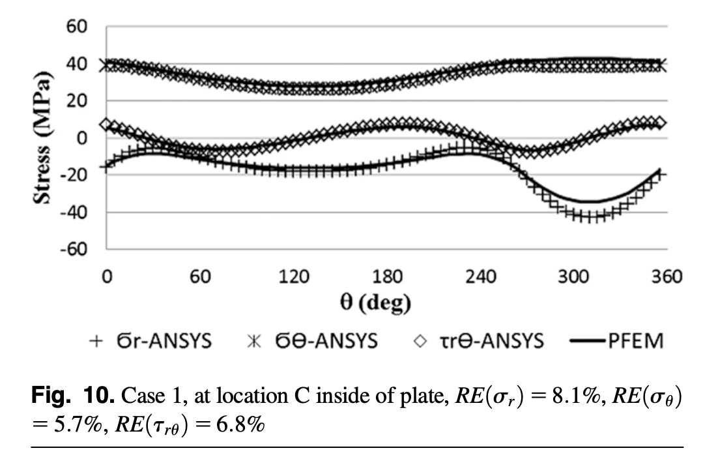

# Precise Finite-Element Model for Pulleys Based on the Hamiltonian Form of Elasticity

**Authors:** Xiangjun Qiu¹; Chang Chai²; and Ryan Lemmon³

**Affiliations:**
1. Chief Scientist, High Fidelity Simulation, Metso Minerals, 4820 Centennial Blvd., Colorado Springs, CO 80919, USA. E-mail: Xiangjun.Qiu@metso.com
2. Associate Professor, School of Machinery and Automobile Engineering, Hefei University of Technology, Hefei, Anhui 230009, China (corresponding author). E-mail: chai416@163.com
3. President, Advanced Conveyor Technologies Inc., 3911 E. 132 N, Rigby, ID 83442, USA. E-mail: lemmon@actek.com

**Publication:** Journal of Engineering Mechanics (ASCE), 2014  
**DOI:** 10.1061/(ASCE)EM.1943-7889.0000746  
**Manuscript submitted:** February 14, 2013  
**Approved:** October 30, 2013  
**Published online:** November 4, 2013

---

## Abstract

Conveyor pulleys are typical axisymmetric structures subjected to nonaxisymmetric loading. Taking full advantage of the characteristics of the pulley structure, this paper presents a **precise finite-element formulation** for pulley stress analysis based on the **Hamiltonian form of elasticity**. 

In the model, the solution is expanded into a set of Fourier series; a paired set of state variables are selected from the Fourier coefficients; and the governing equations are reorganized in Hamiltonian form with the use of the paired state variables. The general solutions to the Hamiltonian system can be obtained numerically and formulated into a finite-element model, from which the final stress solution for a pulley can be found. 

Numerical examples show that this method is much more efficient than the conventional FEM with comparable accuracy.

**Author keywords:** Pulley; Fourier series; Hamiltonian system; Precise finite-element method (FEM); Timoshenko beam; Shell and plate.

---

## Nomenclature

### Coordinate Systems and Basic Variables
| Symbol | Description |
|:--|:--|
| x | Axial coordinate for cylindrical shell (rim) |
| θ, φ | Circumferential angle coordinate |
| r | Radial coordinate for circular plate (disk) |
| R | Radius of cylindrical shell (rim) |
| u, v, w | Displacements in axial, circumferential, and radial directions |
| t | Thickness of shell or plate |
| E | Young's modulus |
| ν | Poisson's ratio |
| D | Plate/shell bending stiffness, D = Et³/12(1-ν²) |
| G | Shear modulus |

### Cylindrical Shell (Rim) Variables
| Symbol | Description |
|:--|:--|
| N₁, N₂ | Normal membrane stresses in axial and circumferential directions |
| N₁₂, N₂₁ | In-plane shear stresses |
| Q₁, Q₂ | Transverse shear stresses |
| M₁, M₂ | Bending moments in axial and circumferential directions |
| M₁₂, M₂₁ | Twisting moments |
| X, Y, Z | External surface loads in x-, θ-, and z-directions |
| F₁ | Effective shear force, F₁ = N₂₁ + 2M₁₂/R |
| V₁ | Effective transverse force, V₁ = ∂M₁/∂x + (2/R)∂M₁₂/∂θ |
| φ̇ | Derivative of transverse displacement, φ̇ = -∂w/∂x |

### Circular Plate (Disk) Variables
| Symbol | Description |
|:--|:--|
| Nᵣ, Nθ | Normal membrane stresses in radial and circumferential directions |
| Nᵣθ | In-plane shear stress |
| Qᵣ, Qθ | Transverse shear stresses |
| Mᵣ, Mθ | Bending moments in radial and circumferential directions |
| Mᵣθ | Twisting moment |
| Vᵣ | Effective transverse force, Vᵣ = Qᵣ - (1/r)∂Mᵣθ/∂θ |
| φ | Rotation angle, φ = ∂u/∂r |
| c, b | Thickness variation parameters, t = crᵇ |

### Shaft (Beam and Bar) Variables
| Symbol | Description |
|:--|:--|
| wₛ | Transverse displacement of shaft |
| γ | Rotation angle of shaft cross-section |
| uₛ | Axial displacement of shaft |
| β | Rotation angle about shaft axis (torsion) |
| V, M | Transverse force and bending moment |
| N, Mₜ | Axial force and torsional moment |
| Iₛ | Area moment of inertia |
| Jₛ | Polar moment of inertia |
| k | Shear shape factor (0.75 for circular section) |
| a | Cross-sectional area |
| L | Length of beam/bar element |
| α | Timoshenko shear parameter, α = 12EIₛ/(L²kaG) |

### Fourier Series and State Variables
| Symbol | Description |
|:--|:--|
| n | Fourier harmonic number |
| uₙ, vₙ, wₙ | Fourier coefficients of displacements |
| φₙ, φ̇ₙ | Fourier coefficients of rotation angles |
| N₁,ₙ, N₂,ₙ, etc. | Fourier coefficients of stress resultants |
| qₙ | Generalized displacement state vector |
| pₙ | Generalized force state vector |
| Xₙ, Yₙ, Zₙ | Fourier coefficients of external loads |

### Hamiltonian System Matrices
| Symbol | Description |
|:--|:--|
| Aₙ, Bₙ, Cₙ, Dₙ | Sub-matrices in Hamiltonian system |
| Tₙ(x) | Transfer matrix for mode n |
| Tₙ,qq, Tₙ,qp, Tₙ,pq, Tₙ,pp | Sub-blocks of transfer matrix |
| Fₙ,q, Fₙ,p | External load contributions to solution |

### Finite Element Variables
| Symbol | Description |
|:--|:--|
| Kₙ | Element stiffness matrix for mode n |
| Uₙ | Element displacement vector |
| Fₙ,int | Internal force vector |
| Fₙ,ext | External force vector |
| Kbm, Kbar | Beam and bar element stiffness matrices |
| Ubm, Ubar | Beam and bar displacement vectors |
| Fbm, Fbar | Beam and bar force vectors |

### Global Assembly Variables
| Symbol | Description |
|:--|:--|
| Rshaft | Radius of shaft at connection point |
| θ₁, θ₂ | Angular extent of belt contact |
| T₁, T₂ | Belt tensions |

### Error Metrics
| Symbol | Description |
|:--|:--|
| RE(σ) | Relative RMS error for stress component σ |
| σ₁max | Maximum principal stress |
| σ₂min | Minimum principal stress |
| ‖σ‖∞ | Maximum absolute value of stress |

---

## 1. Introduction

### 1.1 Background

A conveyor pulley consists of rim, disk, and shaft components assembled through weld and locking devices (Figure 1). In a belt conveyor system, pulleys play important roles as:
- Drive pulley
- Tail pulley
- Take-up pulley
- Bend pulley

In a typical, long-distance conveyor system, where the belt tension can be as high as several million Newtons, a pulley is subjected to severe bending and torsional load. Failure of a pulley in a conveyor system may be catastrophic. Therefore, accurate and efficient modeling of stress distribution in a pulley is of significant scientific and engineering value.

### 1.2 Historical Development

The effort of modeling stress distribution in a pulley structure can be traced to the 1960s, when Lange (1963) tried to use an approximate analytical method to estimate the conveyor pulley stress. However, modern FEM results have proven that Lange's work was very inaccurate (Qiu and Sethi 1993).

### 1.3 Current Practice

Currently, according to Patel et al. (2011), the most popular method used for pulley stress analysis is the FEM. Several researchers have contributed to this field:

- **Ravikumar and Chattopadhyay (1999)** developed a two-dimensional (2D) finite-element model based on Fourier series for pulley stress analysis.
- **Martins and Kovesdy (2012)** summarized the use of three-dimensional (3D) solid elements to solve the conveyor pulley stress problem.
- **Multiple researchers** (Sethi and Nordell 1993; Pathan et al. 2011) reported the use of commercial FEM software to compute the pulley stress distributions.

As computer hardware technology advances, the computational time for completion of a FEM analysis of a conveyor pulley has been shortened from a few days in the 1990s to less than 1 hour today.

### 1.4 Need for More Efficient Methods

Still, designers never stop seeking more efficient methods for pulley stress analysis for the purpose of efficient design optimization among various options. 

**Qiu and Sethi (1993)** developed a very efficient and effective analytical model for pulley stress distribution named **Modified Transfer Matrix Method (MTMM)**. It uses the paired displacement-stress variables to reorganize the governing equations, expresses the general solution in the form of transfer matrix, and further modifies the transfer matrix form into a finite-element formulation.

### 1.5 Limitations of MTMM

However, this method relies on the availability of the analytical solution of the governing equation for each pulley component. In case the governing equations are too complicated to obtain an analytical solution, an approximate solution has to be used as a substitute. 

In Qiu and Sethi's (1993) work, the major approximate solution employed was Timoshenko and Woinowsky-Krieger's (1959) approximate solution to the cylindrical shell, in which the terms of circumferential displacement in strain-displacement relations are neglected for mathematical convenience. 

**The consequence of this approximation is that four of six modes of rigid body motions are no longer preserved in the solution and errors are unavoidable in certain cases.**

### 1.6 The Present Work: PFEM

This paper modifies the Qiu and Sethi (1993) model by:

1. **Presenting the governing equations** for each pulley component in a form of Hamiltonian system without any approximation
2. **Deriving the general solution** to the Hamiltonian system using a precise numerical integration method
3. **Reorganizing the general solution** in finite-element form
4. **Numerically solving** the finite-element equations for final stress solution

This modification leads to a new method named **Precise FEM (PFEM)**. 

It must be pointed out that the fundamental ideas of PFEM are similar to those used in Qiu's (2006, 2009) boundary element models for rolling resistance. The interrelation of the model presented in this paper to the rolling resistance models (Qiu 2006, 2009) is addressed subsequently.

### 1.7 Structure of the Paper

Figure 1 shows a pulley structure, which, from the mechanics point of view, consists of cylindrical shell, plate, and beam components. The theories of shell, plate, and beam are used to develop a precise finite element for each component. The following sections detail:

- Section 2: Modeling of rim as thin-walled cylindrical shell
- Section 3: Modeling of disk as thin-walled circular plate
- Section 4: Modeling of shaft as beam and bar
- Section 5: Assembly of global finite elements
- Section 6: Numerical examples and validation
- Section 7: Comparison to MTMM
- Section 8: Conclusions

---

## 2. Modeling Rim as Thin-Walled Cylindrical Shell

### 2.1 Coordinate System and Stress Resultants

Figure 2 shows the coordinate system for a cylindrical shell with radius R and the stresses and stress couples acting on a differential element.

### 2.2 Equilibrium Equations

According to Ventsel and Krauthammer (2001), the equilibrium equations can be written as:

$$\frac{\partial N_1}{\partial x} + \frac{1}{R}\frac{\partial N_{21}}{\partial \theta} + X = 0 \tag{1}$$

$$\frac{\partial N_{12}}{\partial x} + \frac{1}{R}\frac{\partial N_2}{\partial \theta} + \frac{Q_2}{R} + Y = 0 \tag{2}$$

$$\frac{\partial Q_1}{\partial x} + \frac{1}{R}\frac{\partial Q_2}{\partial \theta} - \frac{N_2}{R} + Z = 0 \tag{3}$$

$$Q_1 = \frac{\partial M_1}{\partial x} + \frac{1}{R}\frac{\partial M_{21}}{\partial \theta} \tag{4}$$

$$Q_2 = \frac{\partial M_{12}}{\partial x} + \frac{1}{R}\frac{\partial M_2}{\partial \theta} \tag{5}$$

$$N_{12} - N_{21} - \frac{M_{21}}{R} = 0 \tag{6}$$

where:
- N₁, N₂, N₂₁, and N₁₂ = membrane stresses
- Q₁ and Q₂ = transverse stresses
- M₁, M₂, M₁₂, and M₂₁ = stress couples
- X, Y, and Z = components of external surface load in x-, θ-, and z-directions

### 2.3 Constitutive Relations

The constitutive equations can be written as:

$$N_1 = \frac{Et}{1-\nu^2}\left(\frac{\partial u}{\partial x} + \nu\frac{1}{R}\frac{\partial v}{\partial \theta} + \nu\frac{w}{R}\right) \tag{7}$$

$$N_2 = \frac{Et}{1-\nu^2}\left(\frac{1}{R}\frac{\partial v}{\partial \theta} + \frac{w}{R} + \nu\frac{\partial u}{\partial x}\right) \tag{8}$$

$$N_{21} = \frac{Et}{2(1+\nu)}\left(\frac{1}{R}\frac{\partial u}{\partial \theta} + \frac{\partial v}{\partial x}\right) \tag{9}$$

$$M_1 = -D\left(\frac{\partial^2 w}{\partial x^2} + \nu\frac{1}{R^2}\frac{\partial^2 w}{\partial \theta^2} - \nu\frac{1}{R^2}\frac{\partial v}{\partial \theta}\right) \tag{10}$$

$$M_2 = -D\left(\frac{1}{R^2}\frac{\partial^2 w}{\partial \theta^2} - \frac{1}{R^2}\frac{\partial v}{\partial \theta} + \nu\frac{\partial^2 w}{\partial x^2}\right) \tag{11}$$

$$M_{12} = M_{21} = -D(1-\nu)\left(\frac{1}{R}\frac{\partial^2 w}{\partial x\partial\theta} - \frac{1}{R}\frac{\partial v}{\partial x}\right) \tag{12}$$

where:
- u, v, and w = displacements in x-, θ-, and z-directions, respectively
- E and ν = Young's modulus and Poisson's ratio of the pulley material
- D = Et³/12(1-ν²)

### 2.4 Boundary Variables

The boundary conditions on the edge x = xₚ can be formulated in terms of the following four pairs of displacement-stress variables:

$$(u, v, w, \dot{w}, N_1, F_1, V_1, M_1) \tag{13}$$

where:

$$F_1 = N_{21} + \frac{2M_{12}}{R} \tag{14}$$

$$V_1 = \frac{\partial M_1}{\partial x} + \frac{2}{R}\frac{\partial M_{12}}{\partial \theta} \tag{15}$$

$$\dot{w} = -\frac{\partial w}{\partial x} \tag{16}$$

### 2.5 Reduced Equilibrium Equations

Eliminating Q₁, Q₂, M₂₁, and N₁₂ from Eqs. (1)–(6) and Eqs. (13)–(15), the equilibrium equations can be reduced to the following:

$$\frac{\partial N_1}{\partial x} + \frac{1}{R}\frac{\partial N_{21}}{\partial \theta} + X = 0 \tag{17}$$

$$\frac{\partial F_1}{\partial x} + \frac{1}{R}\frac{\partial N_2}{\partial \theta} + \frac{1}{R^2}\frac{\partial M_2}{\partial \theta} + Y = 0 \tag{18}$$

$$\frac{\partial V_1}{\partial x} + \frac{1}{R^2}\frac{\partial^2 M_2}{\partial \theta^2} - \frac{N_2}{R} + Z = 0 \tag{19}$$

### 2.6 Fourier Series Expansion

Because of axisymmetry, the solution can be expressed by the following Fourier series:

$$u(x,\theta) = u_0(x) + \sum_{n=1}^{\infty}[u_n(x)\cos n\theta + u_{-n}(x)\sin n\theta] \tag{20}$$

$$v(x,\theta) = v_0(x) + \sum_{n=1}^{\infty}[v_n(x)\sin n\theta + v_{-n}(x)\cos n\theta] \tag{21}$$

$$w(x,\theta) = w_0(x) + \sum_{n=1}^{\infty}[w_n(x)\cos n\theta + w_{-n}(x)\sin n\theta] \tag{22}$$

Similar expansions apply for stress resultants:

$$N_1(x,\theta) = N_{1,0}(x) + \sum_{n=1}^{\infty}[N_{1,n}(x)\cos n\theta + N_{1,-n}(x)\sin n\theta] \tag{23}$$

$$N_2(x,\theta) = N_{2,0}(x) + \sum_{n=1}^{\infty}[N_{2,n}(x)\cos n\theta + N_{2,-n}(x)\sin n\theta] \tag{24}$$

$$N_{21}(x,\theta) = N_{21,0}(x) + \sum_{n=1}^{\infty}[N_{21,n}(x)\sin n\theta + N_{21,-n}(x)\cos n\theta] \tag{25}$$

$$M_1(x,\theta) = M_{1,0}(x) + \sum_{n=1}^{\infty}[M_{1,n}(x)\cos n\theta + M_{1,-n}(x)\sin n\theta] \tag{26}$$

$$M_2(x,\theta) = M_{2,0}(x) + \sum_{n=1}^{\infty}[M_{2,n}(x)\cos n\theta + M_{2,-n}(x)\sin n\theta] \tag{27}$$

$$M_{12}(x,\theta) = M_{12,0}(x) + \sum_{n=1}^{\infty}[M_{12,n}(x)\sin n\theta + M_{12,-n}(x)\cos n\theta] \tag{28}$$

$$V_1(x,\theta) = V_{1,0}(x) + \sum_{n=1}^{\infty}[V_{1,n}(x)\cos n\theta + V_{1,-n}(x)\sin n\theta] \tag{29}$$

$$F_1(x,\theta) = F_{1,0}(x) + \sum_{n=1}^{\infty}[F_{1,n}(x)\sin n\theta + F_{1,-n}(x)\cos n\theta] \tag{30}$$

$$\dot{w}(x,\theta) = \dot{w}_0(x) + \sum_{n=1}^{\infty}[\dot{w}_n(x)\cos n\theta + \dot{w}_{-n}(x)\sin n\theta] \tag{31}$$

### 2.7 Fourier Coefficient Equations

For simplicity, drop the (x) in all the preceding Fourier coefficients [e.g., N₁,ₙ stands for N₁,ₙ(x)].

Substituting Eqs. (20)–(31) into Eqs. (7)–(19):

$$\dot{N}_{1,n} + \frac{n}{R}N_{21} + X_n = 0 \tag{32}$$

$$-\frac{n}{R}N_{2,n} + \dot{F}_{1,n} - \frac{n}{R^2}M_{2,n} + Y_n = 0 \tag{33}$$

$$-\frac{n^2}{R^2}M_{2,n} + \dot{V}_{1,n} - \frac{1}{R}N_{2,n} + Z_n = 0 \tag{34}$$

$$V_{1,n} = \dot{M}_{1,n} + \frac{2n}{R}M_{12,n} \tag{35}$$

$$F_{1,n} = N_{21,n} + \frac{2}{R}M_{12,n} \tag{36}$$

$$\dot{w}_n = -w_n \tag{37}$$

$$N_{1,n} = \frac{Et}{1-\nu^2}\left(\dot{u}_n + \frac{\nu n}{R}v_n + \frac{\nu}{R}w_n\right) \tag{38}$$

$$N_{2,n} = \frac{Et}{1-\nu^2}\left(\frac{n}{R}v_n + \frac{1}{R}w_n + \nu\dot{u}_n\right) \tag{39}$$

$$N_{21,n} = \frac{Et}{2(1+\nu)}\left(-\frac{n}{R}u_n + \dot{v}_n\right) \tag{40}$$

$$M_{1,n} = D\left(\dot{w}_n + \frac{\nu n^2}{R^2}w_n + \frac{\nu n}{R^2}v_n\right) \tag{41}$$

$$M_{2,n} = D\left(\frac{n^2}{R^2}w_n + \frac{n}{R^2}v_n + \nu\dot{w}_n\right) \tag{42}$$

$$M_{12,n} = -D(1-\nu)\left(\frac{n}{R^2}w_n - \frac{1}{R}\dot{v}_n\right) \tag{43}$$

where the updot symbol denotes the derivative with respect to x (i.e., u̇ₙ = duₙ/dx); Xₙ, Yₙ, and Zₙ = Fourier coefficients of X, Y, and Z, respectively.

### 2.8 Hamiltonian State Variables

Let:

$$q_n = (u_n, v_n, w_n, w_n)^T \quad \text{and} \quad p_n = (-2\pi R N_{1,n}, -2\pi R F_{1,n}, -2\pi R V_{1,n}, -2\pi R M_{1,n})^T \tag{44}$$

From the preceding equations, one can derive the following ordinary differential equation (ODE) for the nth-order Fourier coefficients of q and p of Eq. (44):

$$\begin{bmatrix}\dot{q}_n \\ \dot{p}_n\end{bmatrix} = \begin{bmatrix}A_n & B_n \\ C_n & D_n\end{bmatrix}\begin{bmatrix}q_n \\ p_n\end{bmatrix} + \begin{bmatrix}0 \\ f_n\end{bmatrix} \tag{45}$$

where:

$$f_n = (-2\pi R X_n, -2\pi R Y_n, -2\pi R Z_n, 0)^T \tag{46}$$

### 2.9 Hamiltonian System Matrices

The matrices Aₙ, Bₙ, Cₙ, and Dₙ are given by:

$$A_n = \begin{bmatrix}
0 & -\frac{\nu n}{R} & -\frac{\nu}{R} & 0 \\
\frac{EtnR}{EtR^2 + 4(1-\nu^2)D} & 0 & 0 & \frac{4(1-\nu^2)Dn}{EtR^2 + 4(1-\nu^2)D} \\
0 & 0 & 0 & 1 \\
0 & -\frac{\nu n}{R^2} & -\frac{\nu n^2}{R^2} & 0
\end{bmatrix} \tag{47}$$

$$B_n = \begin{bmatrix}
\frac{1-\nu^2}{2\pi REt} & 0 & 0 & 0 \\
0 & \frac{(1+\nu)R}{2\pi(EtR^2 + 4(1-\nu^2)D)} & 0 & 0 \\
0 & 0 & 0 & 0 \\
0 & 0 & 0 & \frac{1}{2\pi RD}
\end{bmatrix} \tag{48}$$

$$C_n = \begin{bmatrix}
\frac{4\pi(1-\mu)n^2EtD}{EtR^3 + 4(1-\nu^2)RD} & 0 & 0 & -\frac{4\pi(1-\mu)n^2EtD}{EtR^2 + 4(1-\nu^2)D} \\
0 & \frac{2\pi n^2Et}{R} + \frac{2\pi(1-\nu^2)n^2D}{R^3} & \frac{2\pi nEt}{R} + \frac{2\pi(1-\nu^2)n^3D}{R^3} & 0 \\
0 & \frac{2\pi nEt}{R} + \frac{2\pi(1-\nu^2)n^3D}{R^3} & \frac{2\pi Et}{R} + \frac{2\pi(1-\nu^2)n^4D}{R^3} & 0 \\
-\frac{4\pi(1-\mu)n^2EtD}{EtR^2 + 4(1-\nu^2)D} & 0 & 0 & \frac{4\pi n^2(1-\mu)D}{R} - \frac{16\pi(1+\mu)(1-\nu^2)n^2D^2}{EtR^3 + 4(1-\nu^2)RD}
\end{bmatrix} \tag{49}$$

$$D_n = \begin{bmatrix}
0 & -\frac{EtnR}{EtR^2 + 4(1-\nu^2)D} & 0 & 0 \\
\frac{\nu n}{R} & 0 & 0 & \frac{\nu n}{R^2} \\
\frac{\nu}{R} & 0 & 0 & \frac{\nu n^2}{R^2} \\
0 & -\frac{4(1-\nu^2)nD}{EtR^2 + 4(1-\nu^2)D} & 1 & 0
\end{bmatrix} \tag{50}$$

### 2.10 Hamiltonian Properties

It can be seen that Aₙ, Bₙ, Cₙ, and Dₙ have the following properties:

$$A_n = -D_n^T; \quad B_n = B_n^T; \quad C_n = C_n^T \tag{51}$$

### 2.11 General Solution - Transfer Matrix

The general solution to Eq. (45) can be written as:

$$\begin{bmatrix}q_n(x) \\ p_n(x)\end{bmatrix} = T_n(x)\begin{bmatrix}q_n(0) \\ p_n(0)\end{bmatrix} + \int_0^x T_n(x-t)\begin{bmatrix}0 \\ f_n(t)\end{bmatrix}dt \tag{52}$$

where Tₙ(x) = transfer matrix. Let:

$$T_n(x) = \begin{bmatrix}T_{n,qq} & T_{n,qp} \\ T_{n,pq} & T_{n,pp}\end{bmatrix} \quad \text{and} \quad \int_0^x T_n(x-t)\begin{bmatrix}0 \\ f_n(t)\end{bmatrix}dt = \begin{bmatrix}F_{n,q} \\ F_{n,p}\end{bmatrix} \tag{53}$$

### 2.12 Finite-Element Form

Eq. (52) can be reorganized in a form of finite-element model:

$$K_n U_n = F_{n,\text{int}} + F_{n,\text{ext}} \tag{54}$$

where:

$$K_n = \begin{bmatrix}-2T_{n,qp} & 0 \\ -2T_{n,pp} & -I\end{bmatrix}^{-1}\begin{bmatrix}-2T_{n,qq} & I \\ -2T_{n,pq} & 0\end{bmatrix}$$

$$U_n = \begin{bmatrix}q_n(0) \\ q_n(x)\end{bmatrix}$$

$$F_{n,\text{int}} = \begin{bmatrix}-p_n(0) \\ p_n(x)\end{bmatrix}$$

$$F_{n,\text{ext}} = \begin{bmatrix}-2T_{n,qp} & 0 \\ -2T_{n,pp} & -I\end{bmatrix}^{-1}\begin{bmatrix}F_{n,q} \\ F_{n,p}\end{bmatrix}$$

### 2.13 Important Remarks

**The following comments apply to these preceding equations:**

1. **Hamiltonian System**: The mathematical properties described by Eq. (51) guarantee that the ODEs of Eq. (45) are a Hamiltonian system (Vinogradov and Kupershmidt 1981; Zhong 1995). The corresponding Hamiltonian function can be expressed as:

   $$H(p_n, q_n) = \frac{1}{2}p_n^T B_n p_n + p_n^T A_n q_n - \frac{1}{2}q_n^T C_n q_n$$

   With the use of Hamiltonian function, Eq. (45) also can be written as:
   
   $$\dot{q}_n = \frac{\partial H}{\partial p_n} \quad \text{and} \quad \dot{p}_n = -\frac{\partial H}{\partial q_n}$$

   Note that the mathematical properties of Eq. (51) only can be preserved when the displacement-stress pairs of variables, called state variables, for boundary conditions [i.e., Eq. (13)] are selected correctly.

2. **Precise Numerical Integration**: It is difficult to obtain the transfer matrix Tₙ(x) of Eq. (52) analytically. But Tₙ(x) can be calculated precisely by using the so-called **precise numerical integration method** suggested by Zhong et al. (1996).

3. **PFEM Definition**: Because Eq. (54) takes the form of a finite-element model, it can be assembled with other finite elements discussed subsequently to form a global FEM equation to represent the mechanical behavior of a pulley structure. Because there is **no interpolation approximation** used in the development of Eq. (54) [i.e., the formulation of Eq. (54) is mathematically exact], the authors call the precise finite-element model developed in this paper the **PFEM**.

4. **Relation to Rolling Resistance Models**: It is noted that in Qiu's (2006, 2009) boundary element models for rolling resistance, a similar form of governing ODE to that of Eq. (45) is derived, which can be proved to satisfy the properties of Eq. (51) in the domain of complex numbers.

5. **Comparison to MTMM**: In Qiu and Sethi (1993), the terms associated with the circumferential displacement v in Eqs. (10)–(12) are omitted for the purpose of convenience to obtain analytical solution of transfer matrix (Timoshenko and Woinowsky-Krieger 1959). **The consequence of the omission is that four modes of rigid body motions are no longer preserved.**

---

## 3. Modeling Disk as Thin-Walled Circular Plate

### 3.1 Coordinate System and Variable Thickness

Figure 3 shows the coordinate system for a circular plate and the stresses and stress couples acting on a differential element. The thickness, denoted by t, of the circular plate varies as the following function of radius:

$$t = cr^b \tag{55}$$

where c and b are constants determined by the disk geometry.

### 3.2 Equilibrium Equations

According to Ventsel and Krauthammer (2001), the equilibrium equations can be written as:

$$\frac{\partial N_r}{\partial r} + \frac{N_r - N_\theta}{r} + \frac{1}{r}\frac{\partial N_{r\theta}}{\partial \theta} = 0 \tag{56}$$

$$\frac{\partial N_{r\theta}}{\partial r} + \frac{2}{r}N_{r\theta} + \frac{1}{r}\frac{\partial N_\theta}{\partial \theta} = 0 \tag{57}$$

$$\frac{\partial Q_r}{\partial r} + \frac{Q_r}{r} - \frac{1}{r}\frac{\partial Q_\theta}{\partial \theta} = 0 \tag{58}$$

$$Q_r = \frac{\partial M_r}{\partial r} + \frac{M_r - M_\theta}{r} - \frac{1}{r}\frac{\partial M_{r\theta}}{\partial \theta} \tag{59}$$

$$Q_\theta = \frac{\partial M_{r\theta}}{\partial r} + \frac{2}{r}M_{r\theta} - \frac{1}{r}\frac{\partial M_\theta}{\partial \theta} \tag{60}$$

where:
- Nᵣ, Nθ, and Nᵣθ = membrane stresses
- Qᵣ and Qθ = transverse stresses
- Mᵣ, Mθ, and Mᵣθ = stress couples

### 3.3 Constitutive Equations

The constitutive equations can be written as:

$$N_r = \frac{Et}{1-\nu^2}\left(\frac{\partial w}{\partial r} + \nu\frac{1}{r}\frac{\partial v}{\partial \theta} + \nu\frac{w}{r}\right) \tag{61}$$

$$N_\theta = \frac{Et}{1-\nu^2}\left(\frac{1}{r}\frac{\partial v}{\partial \theta} + \frac{w}{r} + \nu\frac{\partial w}{\partial r}\right) \tag{62}$$

$$N_{r\theta} = \frac{Et}{2(1+\nu)}\left(\frac{1}{r}\frac{\partial w}{\partial \theta} + \frac{\partial v}{\partial r} - \frac{v}{r}\right) \tag{63}$$

$$M_r = -D\left(\frac{\partial^2 u}{\partial r^2} + \nu\frac{1}{r^2}\frac{\partial^2 u}{\partial \theta^2} + \nu\frac{1}{r}\frac{\partial u}{\partial r}\right) \tag{64}$$

$$M_\theta = -D\left(\frac{1}{r^2}\frac{\partial^2 u}{\partial \theta^2} + \frac{1}{r}\frac{\partial u}{\partial r} + \nu\frac{\partial^2 u}{\partial r^2}\right) \tag{65}$$

$$M_{r\theta} = D(1-\nu)\left(\frac{1}{r}\frac{\partial^2 u}{\partial r\partial\theta} - \frac{1}{r^2}\frac{\partial u}{\partial \theta}\right) \tag{66}$$

where u, v, and w = displacements in x-, θ-, and r-directions, respectively.

### 3.4 Boundary Variables

The boundary conditions on the edge r = rₚ can be formulated in terms of the following four pairs of displacement-stress variables:

$$(u, v, w, \varphi, V_r, N_{r\theta}, N_r, -M_r) \tag{67}$$

where:

$$\varphi = \frac{\partial u}{\partial r} \tag{68}$$

$$V_r = Q_r - \frac{1}{r}\frac{\partial M_{r\theta}}{\partial \theta} \tag{69}$$

### 3.5 Reduced Equilibrium Equations

Eliminating Qᵣ and Qθ from Eqs. (57)–(59) and Eq. (68):

$$\frac{\partial V_r}{\partial r} + \frac{V_r}{r} - \frac{2}{r^2}\frac{\partial M_{r\theta}}{\partial \theta} + \frac{1}{r^2}\frac{\partial^2 M_\theta}{\partial \theta^2} = 0 \tag{70}$$

$$V_r = \frac{\partial M_r}{\partial r} + \frac{M_r - M_\theta}{r} - \frac{2}{r}\frac{\partial M_{r\theta}}{\partial \theta} \tag{71}$$

### 3.6 Fourier Series Expansion

Fourier expansions for displacements and stress resultants (Eqs. 72-82 in the paper) follow a similar pattern to those in Section 2.

### 3.7 Hamiltonian State Variables for Disk

Let:

$$q_n = (u_n, v_n, w_n, \varphi_n)^T \quad \text{and} \quad p_n = (-2\pi r V_{r,n}, -2\pi r N_{r\theta,n}, -2\pi r N_{r,n}, 2\pi r M_{r,n})^T \tag{94}$$

From the governing equations, one can derive the following ODE for the nth-order Fourier coefficients:

$$\begin{bmatrix}\dot{q}_n \\ \dot{p}_n\end{bmatrix} = \begin{bmatrix}A_n & B_n \\ C_n & D_n\end{bmatrix}\begin{bmatrix}q_n \\ p_n\end{bmatrix} \tag{95}$$

with block matrices (96)–(99) as specified in the paper.

### 3.8 Variable Coefficient Treatment

To improve conditioning, apply the transformation:

$$q_n = S_q(r) q'_n, \quad p_n = S_p(r) p'_n$$

with:

$$S_q = \text{diag}(1, 1, 1, 1/r)$$

$$S_p = \text{diag}(r^{-2+3b}, r^b, r^b, r^{-2+3b})$$

This leads to a constant-coefficient system in ln r (Eqs. 104–108).

### 3.9 Transfer Matrix for Variable Thickness Plate

The transfer matrix over [r₀, r] is:

$$T_n(r, r_0) = \begin{bmatrix}S_q(r) & 0 \\ 0 & S_p(r)\end{bmatrix} T'_n(\ln r - \ln r_0) \begin{bmatrix}S_q(r_0) & 0 \\ 0 & S_p(r_0)\end{bmatrix}^{-1} \tag{109}$$

This can then be reformulated into finite-element form following the same procedure as for the shell element.

---

## 4. Modeling Shaft as Beam and Bar

### 4.1 Timoshenko Beam Element

Figure 4 shows the beam element for the shaft. As proved by Qiu and Sethi (1993), the following mathematically exact beam element can be obtained by use of Timoshenko's beam theory:

$$K_{bm} U_{bm} = F_{bm} \tag{110}$$

where:

$$U_{bm} = (w_{s0}, \gamma_0, w_{sx}, \gamma_x)^T$$

$$F_{bm} = (V_0, M_0, V_x, M_x)^T$$

$$K_{bm} = \begin{bmatrix}
\frac{12EI_s}{L^3(1+\alpha)} & \frac{6EI_s}{L^2(1+\alpha)} & -\frac{12EI_s}{L^3(1+\alpha)} & \frac{6EI_s}{L^2(1+\alpha)} \\
\frac{6EI_s}{L^2(1+\alpha)} & \frac{(4+\alpha)EI_s}{L(1+\alpha)} & -\frac{6EI_s}{L^2(1+\alpha)} & \frac{12EI_s}{L^3(1+\alpha)} \\
-\frac{12EI_s}{L^3(1+\alpha)} & -\frac{6EI_s}{L^2(1+\alpha)} & \frac{12EI_s}{L^3(1+\alpha)} & -\frac{6EI_s}{L^2(1+\alpha)} \\
\frac{6EI_s}{L^2(1+\alpha)} & \frac{(2-\alpha)EI_s}{L(1+\alpha)} & -\frac{6EI_s}{L^2(1+\alpha)} & \frac{(4+\alpha)EI_s}{L(1+\alpha)}
\end{bmatrix} \tag{111}$$

where:
- wₛ₀ = wₛ(x₀), wₛₓ = wₛ(x)
- γ₀ = γ(x₀), γₓ = γ(x)
- wₛ(x) and γ(x) = transverse displacement and rotation angle of the beam axis
- V(x) and M(x) = transverse force and moment acting at the cross section of the beam
- Iₛ = area moment of inertia
- L = x - x₀
- α = 12EIₛ/(L²kaG) where k is a shape factor equal to 0.75 for circular cross section, a is the area of the cross section, and G is the shear modulus

### 4.2 Bar Element (Axial and Torsion)

For tension and torsion loading, the following mathematically exact element applies:

$$K_{bar} U_{bar} = F_{bar} \tag{112}$$

where:

$$U_{bar} = (u_{s0}, \beta_0, u_{sx}, \beta_x)^T$$

$$F_{bar} = (N_0, M_{t0}, N_x, M_{tx})^T$$

$$K_{bar} = \begin{bmatrix}
\frac{EA}{L} & 0 & -\frac{EA}{L} & 0 \\
0 & \frac{GJ_s}{L} & 0 & -\frac{GJ_s}{L} \\
-\frac{EA}{L} & 0 & \frac{EA}{L} & 0 \\
0 & -\frac{GJ_s}{L} & 0 & \frac{GJ_s}{L}
\end{bmatrix} \tag{113}$$

where:
- uₛ₀ = uₛ(x₀), uₛₓ = uₛ(x)
- β₀ = β(x₀), βₓ = β(x)
- uₛ(x) and β(x) = axial displacement and rotational angle about axis of the shaft
- N(x) and Mₜ(x) = tension and torsional moment acting at the cross section
- Jₛ = polar moment of inertia

---

## 5. Assembly of Global Finite Elements

### 5.1 Element Division

Figure 5 shows a division of finite elements for a pulley. The assembly method of the precise finite elements discussed previously is the same as that in conventional FEM.

### 5.2 Special Connection Conditions

Special attention, however, must be paid to the connection between the shaft element and the disk element. In beam and bar theories, a major assumption is that plane sections remain plane. According to this assumption, the shaft beam element only can contribute to the Fourier series term of n = 1 and -1; and the shaft bar element only can contribute to the Fourier series term of n = 0.

Therefore, at the point of connection between the shaft and disk, the following conditions are imposed to connect the shaft with the disk:

$$w_n = -n v_n \quad n = -1, 1 \tag{114}$$

$$u_n = R_{\text{shaft}} w_n \quad n = -1, 1 \tag{115}$$

$$w_s = w_n \quad n = -1, 1 \tag{116}$$

$$\gamma = w_n \quad n = -1, 1 \tag{117}$$

$$u_s = u_n \quad n = 0 \tag{118}$$

$$\beta = v_n/R_{\text{shaft}} \quad n = 0 \tag{119}$$

$$u_n = v_n = w_n = 0, \quad w_n = 0 \quad |n| > 1 \tag{120}$$

where Rₛₕₐfₜ = radius of the shaft at the connection point.

### 5.3 Loading Application

The belt tension applies a pressure and shear stress on the surface of the pulley rim. Figure 6 shows a typical distribution of such a loading. 

The pressure and shear stress, as a periodic function of θ, can be expanded into Fourier series. The coefficients of the pressure and shear stress are the terms of Zₙ and Yₙ in Eq. (46). Due to the nature of loading, Xₙ = 0 in Eq. (46). 

The integration term of Eq. (52) can be evaluated by using any of the numerical integration methods, of which **5-point Gauss quadrature** is recommended.

---

## 6. Numerical Examples

### 6.1 Overview

Two examples are given to demonstrate the validity of PFEM for pulley stress analysis:
1. **Bend pulley**
2. **Drive pulley**

The major parameters for both pulleys are listed in Table 1. In the two examples, the pulleys (Figure 1) are analyzed by using both PFEM and ANSYS 10 FEM. Owing to symmetry, only half of the pulley is modeled.

### 6.2 Model Parameters

**Table 1: Model Parameters**

#### Material Properties
| Parameter | Bend Pulley | Drive Pulley |
|:--|--:|--:|
| E (GPa) | 206.9 | 206.9 |
| ν | 0.3 | 0.3 |

#### Rim Geometry
| Parameter | Bend Pulley | Drive Pulley |
|:--|--:|--:|
| Length (mm) | 1,550 | 2,200 |
| Diameter (mm) | 610 | 1,362 |
| Thickness (mm) | 20 | 38 |
| Belt width (mm) | 1,300 | 2,000 |

#### Disk Geometry
| Parameter | Bend Pulley | Drive Pulley |
|:--|--:|--:|
| Locking device width (mm) | 88 | 141 |
| Hub outer diameter (mm) | 380 | 800 |
| Hub inner diameter (mm) | 250 | 515 |
| Hub width (mm) | 117 | 155 |
| Disk parameter, c | 381 | 4,189 |
| Disk parameter, b | -0.433 | -0.760 |

#### Shaft Geometry
| Parameter | Bend Pulley | Drive Pulley |
|:--|--:|--:|
| Diameter (mm) | 190 | 420 |
| Length (mm) | 2,240 | 3,360 |
| Bearing-bearing distance (mm) | 1,950 | 2,900 |
| Disk-disk distance (mm) | 1,280 | 2,000 |

#### Loading Parameters
| Parameter | Bend Pulley | Drive Pulley |
|:--|--:|--:|
| θ₁ (degrees) | -10 | 0 |
| θ₂ (degrees) | 270 | 180 |
| T₁ (kN) | 197 | 1,018 |
| T₂ (kN) | 196 | 633 |

### 6.3 FEM Model Details

In the ANSYS FEM model for pulley, two types of axisymmetric-harmonic structural solid elements were tested:
- **Plan 25** (four nodes per element)
- **Plan 83** (eight nodes per element)

Two types of meshes were used:
- **Coarse mesh** (1,088 elements)
- **Fine mesh** (4,690 elements)

There are **71 Fourier terms** (-36 < n < 36) used in the FEM model.

### 6.4 Convergence Study

Figure 7 shows the distribution of stress component σₓ. From Figure 7, it is observed that there is a tendency for solutions to converge to the solution of the Plan 83 model with fine mesh as the mesh gets finer and/or the order of element's polynomial (interpolation) function gets higher.

**Convergence findings:**

1. The deviations of the stress solutions of Plan 25 model with coarse and fine meshes with respect to the solution of Plan 83 model with fine mesh are around **17% and 12%**, respectively, in terms of RMS error defined as:

   $$\text{RMS\_ER}(\sigma) = \frac{\sqrt{\frac{1}{N}\sum_{i=1}^N (\sigma_i^{\text{Test}} - \sigma_i^{\text{P83Fine}})^2}}{\|\sigma\|_\infty} \tag{121}$$

2. The deviation of the stress solutions of Plan 83 model with coarse mesh with respect to that of Plan 83 model with fine meshes is around **1%** in terms of RMS error.

Using the preceding deviation numbers and FEM h-p convergence criterion, the authors concluded that the **ANSYS Plan 83 element model with fine mesh yields a sufficiently accurate solution** for pulley stresses. 

Therefore, ANSYS Plan 83 element model with fine meshes (3,662 and 4,690 elements for the bend and drive pulleys, respectively) was chosen to calculate stresses for the bend and drive pulleys specified in Table 1, for the purpose of validation and verification of PFEM.

### 6.5 PFEM Model Details

In a PFEM model:
- Only **20 elements** are employed
- There are **71 Fourier terms** (-36 < n < 36) used

### 6.6 Comparison Locations

Stress distributions were compared at the following locations:

- **Location A**: Inside rim surface
- **Location B**: Inside rim surface (near rim-disk junction)
- **Location C**: Inside disk surface (near rim-disk junction)
- **Location D**: Inside disk surface
- **Location E**: Bearing center (for reaction forces)

### 6.7 Error Metric

To quantitatively estimate the numerical deviation between the results of PFEM and ANSYS, the following RMS error function, denoted as RE(σ), was used:

$$RE(\sigma) = \frac{\sqrt{\frac{1}{N}\sum_{i=1}^N (\sigma_i^{\text{PFEM}} - \sigma_i^{\text{ANSYS}})^2}}{\|\sigma\|_\infty} \tag{122}$$

### 6.8 Results for Case 1 (Bend Pulley)

Figures 8–11 demonstrate the results of stress distributions at locations A, B, C, and D obtained by the PFEM and ANSYS.

**Figure 8:** Case 1, at location A inside of rim

- RE(σₓ) = 9.3%
- RE(σθ) = 8.2%

**Figure 9:** Case 1, at location B inside of rim

- RE(σₓ) = 11.9%
- RE(σθ) = 5.8%
- RE(τₓθ) = 3.0%

**Figure 10:** Case 1, at location C inside of plate

- RE(σᵣ) = 8.1%
- RE(σθ) = 5.7%
- RE(τᵣθ) = 6.8%

**Figure 11:** Case 1, at location D inside of plate

- RE(σᵣ) = 8.9%
- RE(σθ) = 4.1%
- RE(τᵣθ) = 4.0%

**Table 2: Case 1 Extreme Stresses (MPa) and Bearing Reaction Force (kN) by PFEM**

| Location | Stress type | θ (degrees) | ANSYS | PFEM | Error (%) |
|:--|:--|--:|--:|--:|--:|
| Cross section A inner surface | σ₁max | 310 | 21.5 | 23.5 | 9.6 |
| | σ₂min | 250 | -28.7 | -26.4 | 8.0 |
| Cross section B inner surface | σ₁max | 345 | 32.0 | 33.9 | 5.8 |
| | σ₂min | 0 | -11.0 | -9.9 | 9.8 |
| Cross section C inner surface | σ₁max | 355 | 40.1 | 41.8 | 4.2 |
| | σ₂min | 310 | -43.0 | -34.7 | 19.2 |
| Cross section D inner surface | σ₁max | 340 | 51.4 | 53.4 | 4.0 |
| | σ₂min | 130 | -46.6 | -42.9 | 7.9 |
| Bearing center E | Reaction F | N/A | 126.3 | 125.8 | 0.4 |

### 6.9 Results for Case 2 (Drive Pulley)

Figures 12–15 demonstrate the results of stress distributions at locations A, B, C, and D obtained by the PFEM and ANSYS.

**Figure 12:** Case 2, at location A inside of rim

- RE(σₓ) = 3.9%
- RE(σθ) = 5.3%

**Figure 13:** Case 2, at location B inside of rim

- RE(σₓ) = 17.1%
- RE(σθ) = 8.2%
- RE(τₓθ) = 4.8%

**Figure 14:** Case 2, at location C inside of plate

- RE(σᵣ) = 9.6%
- RE(σθ) = 8.4%
- RE(τᵣθ) = 7.9%

**Figure 15:** Case 2, at location D inside of plate

- RE(σᵣ) = 8.7%
- RE(σθ) = 7.1%
- RE(τᵣθ) = 5.6%

**Table 3: Case 2 Extreme Stresses (MPa) and Bearing Reaction Force (kN) by PFEM**

| Location | Stress type | θ (degrees) | ANSYS | PFEM | Error (%) |
|:--|:--|--:|--:|--:|--:|
| Cross section A inner surface | σ₁max | 90 | 15.5 | 14.6 | 5.2 |
| | σ₂min | 20 | -32.0 | -30.9 | 3.4 |
| Cross section B inner surface | σ₁max | 355 | 41.0 | 42.3 | 3.3 |
| | σ₂min | 310 | -15.4 | -14.7 | 5.1 |
| Cross section C inner surface | σ₁max | 150 | 42.0 | 39.4 | 6.0 |
| | σ₂min | 315 | -100.2 | -83.8 | 16.4 |
| Cross section D inner surface | σ₁max | 275 | 64.5 | 63.8 | 1.1 |
| | σ₂min | 335 | -50.9 | -45.8 | 9.9 |
| Bearing center E | Reaction F | N/A | 825.4 | 823.5 | 0.2 |

### 6.10 Analysis of Results

Evident in Figures 8–15 and Tables 2 and 3:

**At locations A and D:**
- Upper bound of RE values are within **9–10%**
- Upper bound of errors of σ₁max and σ₂min are within **10%**

**At locations B and C:**
- Upper bound of RE values are within **12–17%**
- Upper bound of errors of σ₁max and σ₂min are within **16–19%**

**Reason for larger discrepancies at B and C:**

The larger discrepancies of stresses of PFEM from those of ANSYS at locations B and C may be owing to the fact that locations B and C are much closer to the joint region between the rim and the disk, where the **3D stress state cannot be accurately modeled by the 2D shell and plate theories**. 

However, the inaccuracies of stress distributions in locations B and C are within 16–19% and, therefore, are **within the engineering allowable margin**.

### 6.11 Computational Efficiency

**PFEM Computation:**
- Takes **less than a second** to finish on a laptop computer with a 1.8-GHz AMD processor

**ANSYS Computation:**
- Takes approximately **14 minutes** for the bend pulley on a desktop computer with a 3.07-GHz Intel Core i7-950 processor
- Takes approximately **34 minutes** for the drive pulley

**Efficiency comparison:**
- PFEM is approximately **800-2000 times faster** than ANSYS FEM

### 6.12 Recommended Design Process

It is worth noting that one of the strengths of PFEM is the **much easier set-up of the model and analysis** by using only the information from Table 1. On the other hand, the full FEM model of the pulley, which can handle precisely the pulley geometry and yield accurate solution at locations of stress concentrations, requires a lot of manual preparation work, such as mesh adjustment and test of solution convergence.

**Thus, the authors suggest a way to combine the strengths of both PFEM and FEM in the pulley design process:**

1. **Preliminary optimization**: Use PFEM for selection of good candidate designs among hundreds of candidates
2. **Final optimization**: Use FEM for the selection of the best design among a few good candidates

---

## 7. Comparison to MTMM

### 7.1 MTMM Results

Table 4 shows the σ₁max and σ₂min results of the bend pulley obtained by using Qiu and Sethi's (1993) MTMM.

**Table 4: Case 1 Extreme Stresses (MPa) and Bearing Reaction Force (kN) by MTMM**

| Location | Stress type | θ (degrees) | ANSYS | MTMM | Error (%) |
|:--|:--|--:|--:|--:|--:|
| Cross section A inner surface | σ₁max | 310 | 21.5 | 23.5 | -9.5 |
| | σ₂min | 250 | -28.7 | -26.6 | 7.4 |
| Cross section B inner surface | σ₁max | 345 | 32.0 | 34.2 | 6.6 |
| | σ₂min | 0 | -11.0 | -8.5 | 22.5 |
| Cross section C inner surface | σ₁max | 355 | 40.1 | 41.6 | 3.6 |
| | σ₂min | 310 | -43.0 | -34.3 | 20.1 |
| Cross section D inner surface | σ₁max | 340 | 51.4 | 52.9 | 2.9 |
| | σ₂min | 130 | -46.6 | -42.1 | 9.8 |
| Bearing center E | Reaction F | N/A | 126.3 | 120.2 | 4.8 |

### 7.2 Comparison Analysis

Comparing the results in Table 4 with those in Table 2, the authors conclude that:

**Stress predictions:**
- PFEM **outperforms MTMM marginally** in stress calculations at most locations

**Reaction forces:**
- At the cross section E (bearing location), the resultant reaction force calculated by MTMM is **5% lower** than that of ANSYS
- The resultant reaction force calculated by PFEM yields **almost the same value** as that of ANSYS (0.4% error)

**Reason for difference:**
- PFEM **preserves all six modes of rigid body motions**
- MTMM only **preserves two of six modes** of rigid body motions

This is a significant advantage of PFEM over MTMM, especially for computing support reactions and ensuring overall equilibrium.

---

## 8. Conclusions

A rigorous and efficient precise finite-element model for conveyor pulley has been developed. Two examples of pulleys were chosen to validate PFEM models by comparison of the numerical solutions to ANSYS FEM solution. 

### 8.1 Key Findings

1. **Accuracy**: The numerical examples demonstrated the capabilities and the degree of accuracies of the model:
   - At locations away from stress concentration regions (A and D): errors within 9-10%
   - At locations near rim-disk junction (B and C): errors within 12-17%
   - All errors are within engineering acceptable margins

2. **Efficiency**: PFEM is significantly more efficient than conventional FEM:
   - Computation time: less than 1 second vs. 14-34 minutes (800-2000× faster)
   - Data preparation: only basic geometric parameters needed
   - Mesh generation: not required

3. **Rigid Body Modes**: PFEM preserves all six rigid body modes, unlike MTMM which only preserves two:
   - Results in more accurate reaction force calculations
   - Better overall equilibrium satisfaction
   - Improved accuracy for bearing support analysis

4. **Mathematical Rigor**: The formulation is based on:
   - Hamiltonian form of elasticity
   - Precise numerical integration (no interpolation approximation)
   - Fourier series expansion for axisymmetric structures
   - Transfer matrix method recast in finite-element form

5. **Practical Application**: The methodology may serve as a useful tool for designers of industrial pulleys, particularly for:
   - Preliminary design optimization
   - Parametric studies
   - Rapid evaluation of multiple design alternatives
   - Integration with detailed FEM analysis for final design verification

### 8.2 Recommended Design Strategy

The optimal approach combines both methods:

1. **Use PFEM for**:
   - Initial screening of design alternatives
   - Parametric optimization studies
   - Sensitivity analyses
   - Quick design iterations

2. **Use FEM for**:
   - Final design verification
   - Detailed stress concentration analysis
   - 3D effects near connections
   - Fatigue analysis refinement

### 8.3 Future Work

The PFEM methodology can potentially be extended to:
- Other axisymmetric structures subjected to non-axisymmetric loading
- Dynamic analysis of rotating machinery
- Thermal stress analysis
- Coupled thermal-structural problems
- Optimization algorithms for automated design

---

## References

**ANSYS 10** [Computer software]. Canonsburg, PA, ANSYS.

**Lange, H. (1963).** "Investigations on stress in belt conveyor pulleys." Ph.D. thesis, Technical Univ. Hannover, Hannover, Germany.

**Martins, J. A., and Kövesdy, I. (2012).** "Overview in the application of FEM in mining and the study of case: Stress analysis in pulleys of stacker-reclaimers: FEM vs. analytical." Chapter 13, *Finite element analysis: Applications in mechanical engineering*, F. Ebrahimi, ed., InTech, Rijeka, Croatia, 277–296.

**Patel, R. R., Joshi, S. P., and Agrawal, P. M. (2011).** "Studies on some aspects of conveyor drive pulley design." National Conf. on Recent Trends in Engineering & Technology, BVM Engineering College, Anand, Gujarat, India.

**Pathan, N. W., Bhope, D. V., and Khamankar, S. D. (2011).** "Investigation of stresses in flat belt pulley by FEM and photoelasticity." *Int. J. Eng. Sci. Technol.*, 3(10), 7444–7451.

**Qiu, X. (2006).** "Full two-dimensional model for rolling resistance: Hard cylinder on viscoelastic foundation of finite thickness." *J. Eng. Mech.*, 10.1061/(ASCE)0733-9399(2006)132:11(1241), 1241–1251.

**Qiu, X. (2009).** "Full two-dimensional model for rolling resistance. II: Viscoelastic cylinders on rigid ground." *J. Eng. Mech.*, 10.1061/(ASCE)0733-9399(2009)135:1(20), 20–30.

**Qiu, X., and Sethi, V. (1993).** "A new pulley stress analysis method based on modified transfer matrix method." *J. Bulk Solids Handling*, 13(4), 713–724.

**Ravikumar, M., and Chattopadhyay, A. (1999).** "Integral analysis of conveyor pulley using finite element method." *Comp. Struct.*, 71(3), 303–332.

**Sethi, V., and Nordell, L. K. (1993).** "Modern pulley design techniques and failure analysis methods." Proc., SME Annual Meeting & Exhibition, Society for Mining, Metallurgy, and Exploration, Englewood, CO.

**Timoshenko, S., and Woinowsky-Krieger, S. (1959).** *Theory of plates and shells*, 2nd Ed., McGraw Hill, New York.

**Ventsel, E., and Krauthammer, T. (2001).** *Thin plates and shells theory, analysis, and applications*, Marcel Dekker, New York.

**Vinogradov, A. M., and Kupershmidt, B. A. (1981).** "The structures of Hamiltonian mechanics." *Integrable systems*, Cambridge University Press, London, 173–240.

**Zhong, W. (1995).** *A new systematic methodology for theory of elasticity*, Dalian University of Technology Press, Dalian, China.

**Zhong, W., Zhu, J., and Zhong, X. (1996).** "On a new time integration method for solving time dependent partial differential equations." *Comput. Methods Appl. Mech. Eng.*, 130(1–2), 163–178.

---

## Figures

The paper includes the following figures:

- **Figure 1:** Profile of a pulley structure
- **Figure 2:** Stresses on rim cylindrical differential element
- **Figure 3:** Stresses on disk plate differential element
- **Figure 4:** Beam element for shaft
- **Figure 5:** Finite-element divisions for a pulley
- **Figure 6:** Loading on pulley surface
- **Figure 7:** Observation of convergence of stress σₓ calculated by ANSYS for Case 2, at location B inside of rim
- **Figure 8:** Case 1, at location A inside of rim (stress distributions)
- **Figure 9:** Case 1, at location B inside of rim (stress distributions)
- **Figure 10:** Case 1, at location C inside of plate (stress distributions)
- **Figure 11:** Case 1, at location D inside of plate (stress distributions)
- **Figure 12:** Case 2, at location A inside of rim (stress distributions)
- **Figure 13:** Case 2, at location B inside of rim (stress distributions)
- **Figure 14:** Case 2, at location C inside of plate (stress distributions)
- **Figure 15:** Case 2, at location D inside of plate (stress distributions)

---

## Discussion Period

This paper was submitted for publication on February 14, 2013; approved on October 30, 2013; published online on November 4, 2013. Discussion period open until July 11, 2014; separate discussions must be submitted for individual papers.

---

**© 2014 American Society of Civil Engineers**  
**ISSN 0733-9399**

---

*End of Document*
